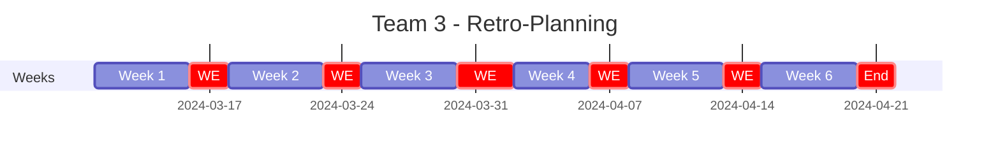
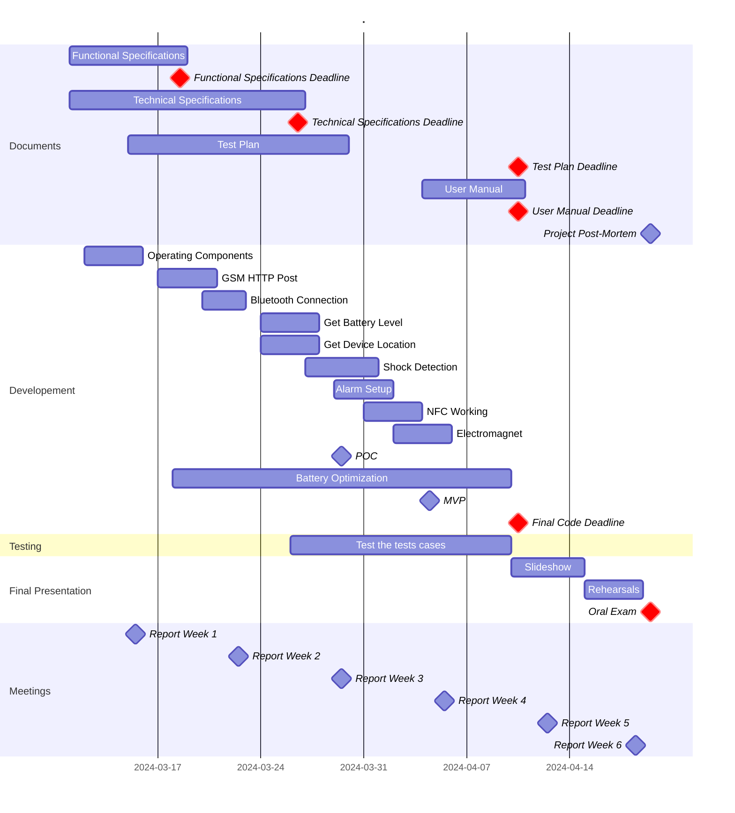

<!-- See: Docs/Specifications/FuncSpecs-Helper.md -->

# Functional Specifications

---
**Title:** SportShield - Team 3

**Author:** Pierre GORIN

**Team:** Team 3

**Reviewer:** Salaheddine NAMIR

**Created on:** March 11th, 2024

**Last updated:** March 18th, 2024

---

### Approvals

| Reviewer          | Role              | Approved | Date       |
| ----------------- | ----------------- | -------- | ---------- |
| Salaheddine NAMIR | Quality Assurance | ✅        | 03/18/2024 |
| Mouatassime SEIV  | Project Manager   | ✅        | 03/18/2024 |
| Pierre GORIN      | Program Manager   | ✅        | 03/18/2024 |
| Abderrazaq MAKRAN | Technical Lead    | ✅        | 03/18/2024 |
| Michel RIFF       | Technical Writer  | ✅        | 03/18/2024 |
| Guillaume DESPAUX | Software Engineer | ✅        | 03/18/2024 |

 

<h2 id="toc"> Table of Contents <i>(Click to expand)</i></h2>

- [Functional Specifications](#functional-specifications)
    - [Approvals](#approvals)
- [1. - Introduction](#1---introduction)
  - [1.1 - Overview](#11---overview)
  - [1.2 - Project Definition](#12---project-definition)
    - [1.2.1 - Purpose](#121---purpose)
    - [1.2.2 - Scope](#122---scope)
    - [1.2.3 - Deliverables](#123---deliverables)
  - [1.3 - Project Organization](#13---project-organization)
    - [1.3.1 - Project Representatives](#131---project-representatives)
    - [1.3.2 - Stakeholders](#132---stakeholders)
    - [1.3.3 - Project Team](#133---project-team)
    - [1.3.4 - Project Reviewers](#134---project-reviewers)
  - [1.4 - Project Plan](#14---project-plan)
    - [1.4.1 - Retro-planning](#141---retro-planning)
    - [1.4.2 - Milestones](#142---milestones)
    - [1.4.3 - Resources](#143---resources)
    - [1.4.4 - Assumptions and Constraints](#144---assumptions-and-constraints)
- [2. - Personas](#2---personas)
  - [2.1 - Individual Sports Enthusiasts](#21---individual-sports-enthusiasts)
  - [2.2 - Professional Athletes and Performers](#22---professional-athletes-and-performers)
  - [2.3 - Outdoor and Travel Enthusiasts](#23---outdoor-and-travel-enthusiasts)
- [3. - The Uses Cases](#3---the-uses-cases)
  - [3.1 - Use Cases List](#31---use-cases-list)
  - [3.2 - Use Cases Description](#32---use-cases-description)
    - [3.2.1 - Pair the Device with the Mobile App.](#321---pair-the-device-with-the-mobile-app)
    - [3.2.2 - Add a Security Card to the Device.](#322---add-a-security-card-to-the-device)
    - [3.2.3 - Activate the Anti-Theft Protection using the Mobile App.](#323---activate-the-anti-theft-protection-using-the-mobile-app)
    - [3.2.4 - Activate the Anti-Theft Protection using the Security Card.](#324---activate-the-anti-theft-protection-using-the-security-card)
    - [3.2.5 - Deactivate the Anti-Theft Protection and Unlock the Device using the Mobile App.](#325---deactivate-the-anti-theft-protection-and-unlock-the-device-using-the-mobile-app)
    - [3.2.6 - Deactivate the Anti-Theft Protection and Unlock the Device using the Security Card.](#326---deactivate-the-anti-theft-protection-and-unlock-the-device-using-the-security-card)
    - [3.2.7 - Emit an Audible Alarm when a Light Shock is Detected.](#327---emit-an-audible-alarm-when-a-light-shock-is-detected)
    - [3.2.8 - Emit an Audible Alarm and Send a Notification when a Strong Shock is Detected.](#328---emit-an-audible-alarm-and-send-a-notification-when-a-strong-shock-is-detected)
    - [3.2.9 - Send GPS Coordinates and Battery Level to the API.](#329---send-gps-coordinates-and-battery-level-to-the-api)
    - [3.2.10 - Receive Notifications from the API.](#3210---receive-notifications-from-the-api)
    - [3.2.11 - Send a Notification when the Battery is Low.](#3211---send-a-notification-when-the-battery-is-low)
    - [3.2.12 - Send a Notification when the Battery is Full.](#3212---send-a-notification-when-the-battery-is-full)
    - [3.2.13 - Cut the Alarm with the Mobile App.](#3213---cut-the-alarm-with-the-mobile-app)
    - [3.2.14 - Cut the Alarm with the Security Card.](#3214---cut-the-alarm-with-the-security-card)
- [4. - Features](#4---features)
  - [4.1 - Features List](#41---features-list)
  - [4.2 - Features Description](#42---features-description)
    - [4.2.1 - Bluetooth Pairing](#421---bluetooth-pairing)
    - [4.2.2 - Bluetooth Connection Sound](#422---bluetooth-connection-sound)
    - [4.2.3 - Send a command using BLE](#423---send-a-command-using-ble)
    - [4.2.4 - Confirmation Sound](#424---confirmation-sound)
    - [4.2.5 - Enter in Anti-Theft Mode Sound](#425---enter-in-anti-theft-mode-sound)
    - [4.2.6 - Anti-Theft Protection](#426---anti-theft-protection)
    - [4.2.7 - Light Shock Detection](#427---light-shock-detection)
    - [4.2.8 - Soft Alarm](#428---soft-alarm)
    - [4.2.9 - Strong Shock Detection](#429---strong-shock-detection)
    - [4.2.10 - Loud Alarm](#4210---loud-alarm)
    - [4.2.11 - Electromagnet](#4211---electromagnet)
    - [4.2.12 - Alarm Cut](#4212---alarm-cut)
    - [4.2.13 - Battery Level](#4213---battery-level)
    - [4.2.14 - Low Battery Detection](#4214---low-battery-detection)
    - [4.2.15 - Full Battery Detection](#4215---full-battery-detection)
    - [4.2.16 - GPS Coordinates](#4216---gps-coordinates)
    - [4.2.17 - GSM HTTP Post](#4217---gsm-http-post)
    - [4.2.18 - Notifications](#4218---notifications)
    - [4.2.19 - Enter in Sleep Mode Sound](#4219---enter-in-sleep-mode-sound)
    - [4.2.20 - Sleep Mode](#4220---sleep-mode)
    - [4.2.21 - Security Card Pairing](#4221---security-card-pairing)
    - [4.2.22 - Detect the Security Card](#4222---detect-the-security-card)
- [5. - Hardware and Libraries Used](#5---hardware-and-libraries-used)
  - [5.1 - Hardware](#51---hardware)
    - [5.1.1 - Microcontroller](#511---microcontroller)
    - [5.1.2 - GNSS Module](#512---gnss-module)
    - [5.1.3 - GSM Module](#513---gsm-module)
    - [5.1.4 - Electromagnet](#514---electromagnet)
    - [5.1.5 - Buzzer](#515---buzzer)
    - [5.1.6 - Battery](#516---battery)
    - [5.1.7 - NFC Antenna](#517---nfc-antenna)
  - [5.2 - Libraries](#52---libraries)
    - [5.2.1 - NRF52\_MBED\_TimerInterrupt v1.4.1](#521---nrf52_mbed_timerinterrupt-v141)
    - [5.2.2 - ArduinoBLE v1.3.6](#522---arduinoble-v136)
    - [5.2.3 - Adafruit GPS Library v1.7.4](#523---adafruit-gps-library-v174)
    - [5.2.4 - Sim800L http connector v1.14.0](#524---sim800l-http-connector-v1140)
    - [5.2.5 - Seeed Arduino LSM6DS3 v2.0.3](#525---seeed-arduino-lsm6ds3-v203)
    - [5.2.6 - OneWire v2.3.7](#526---onewire-v237)
- [6. - End Matter](#6---end-matter)
  - [6.1 - Contributors](#61---contributors)
  - [6.2 - License](#62---license)
  - [6.3 - Glossary](#63---glossary)

# 1. - Introduction

## 1.1 - Overview

The SportShield project, led by Coris Innovation, presents an intelligent device designed to protect sports equipment such as bicycles and surfboards. It uses a microcontroller, sensors, and a communication module for GPS tracking, theft alarms, and remote locking/unlocking functions. The device is designed to ensure the safety of sports equipment and peace of mind for users.

## 1.2 - Project Definition

### 1.2.1 - Purpose
[*(Back to top)*](#toc)

The Goals and Objectives of this project are to work on the development of the [SportShield](#glossary-ss) device. The SportShield device is a lockspan powered by a [microcontroller](#glossary-mc) and equipped with a set of [sensors](#glossary-sensor) and a [communication module](#glossary-cm). The device is designed to be attached to sports equipment, such as a pair of skis, a snowboard, a bike, a surf, etc. The device is intended to provide the user with a set of [features](#glossary-feature) to protect the equipment from theft and to monitor the equipment's status.

This Project is piloted by the company [Coris Innovation](https://www.corisinnovation.com/), A company founded in 2015 by [Stéphane MAIGE](https://www.linkedin.com/in/st%C3%A9phane-maige-37710613/) and specialized in the development of innovative products in many fields like Aerospace, Automotive, Energy, Railway, Pharmaceutical, Watchmaking, etc...
[Coris Innovation](#glossary-ci) is made up of a team of 90 employees spread over 5 sites in France and Switzerland.

### 1.2.2 - Scope
[*(Back to top)*](#toc)

| Feature                            | Description                                                                                            | In Scope | Out of Scope |
| ---------------------------------- | ------------------------------------------------------------------------------------------------------ | -------- | ------------ |
| [GPS Tracking](#glossary-gpst)     | The device must be able to provide the user with the [GPS](#glossary-gps) coordinates of the equipment | ✅        |              |
| [Alarm](#glossary-alarm)           | The device must be able to trigger an alarm when the equipment is moved                                | ✅        |              |
| [Remote Locking](#glossary-rlu)    | The device must be able to lock the equipment remotely                                                 | ✅        |              |
| [Remote Unlocking](#glossary-rlu)  | The device must be able to unlock the equipment remotely                                               | ✅        |              |
| [Battery Monitoring](#glossary-bm) | The device must be able to monitor its battery level                                                   | ✅        |              |
| Communication                      | The device must be able to communicate with a Smartphone using Technology                              | ✅        |              |
| Communication                      | The device must be able to communicate with a [NFC](#glossary-nfc) Secure card                         | ✅        |              |
| [User Interface](#glossary-ui)     | The device must be able to provide the user with a user interface                                      |          | ❌            |
| User Authentication                | The application must be able to authenticate the user                                                  |          | ❌            |

### 1.2.3 - Deliverables
[*(Back to top)*](#toc)

The [deliverables](#glossary-deliverable) of this project are:

| Deliverable                               | Link to the Document                                        |
| ----------------------------------------- | ----------------------------------------------------------- |
| [Functional Specifications](#glossary-fs) | [🔗 Functional Specifications](./Functional-Specifications.md) |
| [Technical Specifications](#glossary-ts)  | [🔗 Technical Specifications](./Technical-Specifications.md)   |
| [Test Plan](#glossary-tp)                 | [🔗 Test Plan](./Test-Plan.md)                                 |
| User Manual                               | [🔗 User Manual](./User-Manual.md)                             |
| Code                                      | [🔗 Code](../../Src/software_team3/software_team3.ino)         |

## 1.3 - Project Organization

### 1.3.1 - Project Representatives
[*(Back to top)*](#toc)

| Owners                                                                     | Representative                                                                                         |
| -------------------------------------------------------------------------- | ------------------------------------------------------------------------------------------------------ |
| ***[Coris Innovation](https://www.corisinnovation.com)***                  | Represented by ***[Florent ANON](https://www.linkedin.com/in/florentanon/)***                          |
| ***[ALGOSUP](https://www.algosup.com)***                                   | Represented by ***[Franck JEANNIN](https://www.linkedin.com/in/franck-jeannin/)***                     |
| [Mouatassime SEIV](https://www.linkedin.com/in/moutassime-seiv-9542171a9/) | Represented by [Pierre GORIN](https://www.linkedin.com/in/pierre-gorin-61a784221/  ) (Program Manager) |

The project sponsors (highlighted in ***bold italic***) are expected to be in charge of:

- Defining the vision and high-level objectives for the project.
- Approving the requirements, timetable, and resources.
- Authorising the provision of funds/resources.
- Approving the Functional and [Technical Specifications](./Technical-Specifications.md) written by [the team](#233---project-team).
- Approving any major changes in scope.
- Approving the [Test Plan](./Test-Plan.md) and [User Manual](./User-Manual.pdf) written by the team.
- Received Project [Weekly Reports](../Management/Weekly-Reports/Cumulative.md) and take action accordingly to resolve issues escalated by the Project Manager.
- Providing final acceptance of the solution upon project completion.

### 1.3.2 - Stakeholders
[*(Back to top)*](#toc)

| [Stakeholder](#glossary-sh) | Interest                                                                  |
| --------------------------- | ------------------------------------------------------------------------- |
| Coris Innovation            | The company that initiated the project and will sell the device           |
| ALGOSUP                     | The company that will help with the development of the software           |
| Students                    | The team that will work on the development and optimization of the device |
| End Users                   | The people that will use the device                                       |

### 1.3.3 - Project Team
[*(Back to top)*](#toc)

| Role              | Description                                                                                                                                                                                                                                    | Name                                                     |
| ----------------- | ---------------------------------------------------------------------------------------------------------------------------------------------------------------------------------------------------------------------------------------------- | -------------------------------------------------------- |
| Project Manager   | - He is in charge of organization, planning, and budgeting. - Ensure communication within the team and keep them motivated.                                                                                                                 | [Mouatassime SEIV](https://github.com/seiv007)           |
| Program Manager   | - Makes sure the project meets the client's expectations. - He is the intermediary between the client and the development team. - He is responsible for writing the [Functional Specifications](#glossary-fs).                           | [Pierre GORIN](https://github.com/Pierre2103)            |
| Technical Lead    | - He is in charge of making the technical decisions in the project. - He translates the Functional Specifications into [Technical Specifications](#glossary-ts).                                                                            | [Abderrazaq MAKRAN](https://github.com/Amakran2003)      |
| Technical Writer  | - He is in charge of writing the documentation of the project. - Based on the specifications, he writes a Manual for the end-users.                                                                                                         | [Michel RIFF](https://github.com/MichelRiff)             |
| Software Engineer | - Responsible for writing the code and the unit tests, commenting, and documenting his code. - He participates in the technical choices.                                                                                                    | [Guillaume DESPAUX](https://github.com/GuillaumeDespaux) |
| Quality Assurance | - Tests all the functionalities of the product to find bugs and issues. Defines the test strategy and writes the [test plan](#glossary-tp). - He documents all the encountered bugs and issues, then checks that the errors are well fixed. | [Salaheddine NAMIR](https://github.com/T3rryc)           |

### 1.3.4 - Project Reviewers
[*(Back to top)*](#toc)

External project reviewers have been appointed by the project owner to review our specifications and provide us with feedback.

## 1.4 - Project Plan

### 1.4.1 - Retro-planning
[*(Back to top)*](#toc)

The project will be developed in 6 weeks, from 11th March 2024 to 19th April 2024.

### 1.4.2 - Milestones
[*(Back to top)*](#toc)

| n°  | Milestone                      | Date       |     | n°  | Milestone            | Date       |
| --- | ------------------------------ | ---------- | --- | --- | -------------------- | ---------- |
| 1   | First Weekly Report            | 03/15/2024 |     | 8   | Fourth Weekly Report | 04/05/2024 |
| 2   | Functional Specifications (v1) | 03/18/2024 |     | 9   | Test Plan            | 04/10/2024 |
| 3   | Second Weekly Report           | 03/22/2024 |     | 10  | User Manual          | 04/10/2024 |
| 4   | Technical Specifications (v1)  | 03/26/2024 |     | 11  | Final Code           | 04/10/2024 |
| 5   | POC (Proof of Concept)         | 03/29/2024 |     | 12  | Fifth Weekly Report  | 04/12/2024 |
| 6   | Third Weekly Report            | 03/29/2024 |     | 13  | Final Presentation   | 04/19/2024 |
| 7   | MVP (Minimum Viable Product)   | 04/04/2024 |     | 14  | Project Post-Mortem  | 04/19/2024 |

### 1.4.3 - Resources
[*(Back to top)*](#toc)

- The team (6 people).
- We estimate **504 hours of work** for the whole team *(6 weeks * 6 people * 2 days * 7 hours/day = 504 hours)*.
- The books from the ALGOSUP's library.
- Teachers and professionals from ALGOSUP.
- The Original Source Code of the device.
- The Hardware of the device.
  - [The microcontroller](#611---microcontroller),
  - [GNSS module](#612---gnss-module),
  - [GSM module](#613---gsm-module),
  - [Electromagnet](#614---electromagnet),
  - [Buzzer](#615---buzzer),
  - [Battery](#616---battery),
  - [NFC antenna](#617---nfc-antenna).
- The following documentation:
  - [SIM800L Hardware Design v2.02 (GSM module)](../Hardware/SIM800L-SIMCom.pdf),
  - [LP603449 Battery Datasheet (Battery)](../Hardware/Batterie_LP603449.pdf),
  - [CD-PA1010D Satasheet v02 (GNSS module)](../Hardware/CD-PA1010D-Datasheet-v.02.pdf),
  - [Xiao nRF52840 Product Specification v1.5 (Microcontroller)](../Hardware/nRF52840_PS_v1.5.pdf),
  - [Xiao nRF52840 Blueprints v1.1 (Microcontroller)](../Hardware/Seeed-Studio-XIAO-nRF52840-Sense-v1.1.pdf),
  - [SportShield Electronic Schematic v2 (Device)](../Hardware/SportShield%20-%20Electronics%20diagram.png).
- The following Libraries:
  - [NRF52_MBED_TimerInterrupt v1.4.1](#621---nrf52_mbed_timerinterrupt-v141),
  - [ArduinoBLE v1.3.6](#622---arduinoble-v136),
  - [Adafruit GPS Library v1.7.4](#623---adafruit-gps-library-v174),
  - [Sim800L http connector v1.14.0](#624---sim800l-http-connector-v1140),
  - [Seeed Arduino LSM6DS3 v2.0.3](#625---seeed-arduino-lsm6ds3-v203),
  - [OneWire v2.3.7](#626---onewire-v237).
- The Following Tools:
  - [Arduino IDE](https://www.arduino.cc/en/software),
  - [Visual Studio Code](https://code.visualstudio.com/),
  - [GitHub](https://github.com/),
  - [NFC Tools](https://www.wakdev.com/en/apps/nfc-tools-pc-mac.html),
  - [LightBlue 🤖](https://play.google.com/store/apps/details?id=com.punchthrough.lightblueexplorer&hl=fr).
  - [LightBlue 🍎](https://apps.apple.com/fr/app/lightblue/id557428110?l=en-GB).

### 1.4.4 - Assumptions and Constraints
[*(Back to top)*](#toc)

**Assumptions:**
- The device will be used by people who are familiar with the technology.
- The device will be used in a place where the [GSM](#glossary-gsm) and [GPS](#glossary-gps) signals are available.
- The device will be powered by a 3.7V battery with a capacity of 1100mAh.
- We assume that the device will be used in an environment where the temperature is between -15°C and +45°C.
- We assume that the user will use the original USB-C.
- We assume that the user can buy a [security card](#glossary-sc) to use with the device.

**Constraints:**
- The device must be able to work for at least 7 days without being recharged.
- The device must distinguish between a legitimate movement and a theft attempt.
- The device must be able to communicate with a smartphone using Bluetooth Low Energy (BLE).
- The device must be able to communicate with a server using the [GSM Module](#glossary-gsmm).
- The device must be able to send the [GPS](#glossary-gps) coordinates and battery level to the server using the [GSM](#glossary-gsm) module.
- The device must be able to lock and unlock the equipment using an [electromagnet](#glossary-em).
- All the components of the device must be powered by the battery.

# 2. - Personas

## 2.1 - Individual Sports Enthusiasts
[*(Back to top)*](#toc)

| The Weekend Warrior                                                                                                                                                                                                       | The Extreme Sports Adventurer                                                                                                                                          | The Fitness Fanatic                                                                                                                                                               |
| ------------------------------------------------------------------------------------------------------------------------------------------------------------------------------------------------------------------------- | ---------------------------------------------------------------------------------------------------------------------------------------------------------------------- | --------------------------------------------------------------------------------------------------------------------------------------------------------------------------------- |
|                                                                                                                                                     |                                                                                      |                                                                                                            |
| **Name:** Liam Davis                                                                                                                                                                                                      | **Name:** Sophia Johnson                                                                                                                                               | **Name:** Elena Smith                                                                                                                                                             |
| **Age:** 43                                                                                                                                                                                                               | **Age:** 27                                                                                                                                                            | **Age:** 31                                                                                                                                                                       |
| **Occupation:** Accountant 👨‍💼                                                                                                                                                                                              | **Occupation:** Photographer 📸                                                                                                                                         | **Occupation:** Personal Trainer 🏋️‍♂️                                                                                                                                                |
| **Tech Savviness:** ⭐️⭐️                                                                                                                                                                                                    | **Tech Savviness** ⭐️⭐️⭐️                                                                                                                                                 | **Tech Savviness** ⭐️⭐️⭐️⭐️                                                                                                                                                           |
| **Liam** loves to spend his weekends outside, doing things like skiing, biking, or surfing. He's not very into tech, but **SportShield** is easy for him to use. It keeps his sports stuff safe when he's taking a break. | **Sophia** travels a lot to do exciting sports. She likes **SportShield** because it's strong and keeps her equipment safe everywhere she goes, no matter the weather. | **Elena** is always moving, from the gym to outdoor workouts. She likes **SportShield** because it's easy to use with her phone and it keeps her things safe while she exercises. |

*All images were created using the Dall-E 3 AI generative model.*

## 2.2 - Professional Athletes and Performers
[*(Back to top)*](#toc)

| The Touring Musician                                                                                                                                                                                 | The Competitive Skier                                                                                                                                                          | The Professional Cyclist                                                                                                                                           |
| ---------------------------------------------------------------------------------------------------------------------------------------------------------------------------------------------------- | ------------------------------------------------------------------------------------------------------------------------------------------------------------------------------ | ------------------------------------------------------------------------------------------------------------------------------------------------------------------ |
|                                                                                                                               |                                                                                                    |                                                                                       |
| **Name:** Noah Miller                                                                                                                                                                                | **Name:** Isabella Williams                                                                                                                                                    | **Name:** Oliver Wilson                                                                                                                                            |
| **Age:** 39                                                                                                                                                                                          | **Age:** 26                                                                                                                                                                    | **Age:** 36                                                                                                                                                        |
| **Occupation:** Musician 🎸                                                                                                                                                                           | **Occupation:** Ski Instructor 🎿                                                                                                                                               | **Occupation:** Cyclist 🚴🏻‍♂️                                                                                                                                          |
| **Tech Savviness** ⭐️⭐️                                                                                                                                                                                | **Tech Savviness** ⭐️⭐️⭐️⭐️                                                                                                                                                        | **Tech Savviness** ⭐️⭐️⭐️⭐️⭐️                                                                                                                                           |
| **Noah** goes to different places to play music. He likes **SportShield** because it keeps his instruments safe, especially when he's busy. It's easy for him to check on his things with his phone. | **Isabella** races and teaches skiing. She uses **SportShield** to keep her ski gear safe. It has an [Alarm](#glossary-alarm) and can tell if someone tries to move her stuff. | **Oliver** rides bikes in races. He likes **SportShield** because it can track his bike and tell him if someone tries to take it. It helps him keep his bike safe. |

*All images were created using the Dall-E 3 AI generative model.*

## 2.3 - Outdoor and Travel Enthusiasts
[*(Back to top)*](#toc)

| The Global Backpacker                                                                                                                                             | The Tech-Savvy Traveler                                                                                                                                                  | The Van Life Nomad                                                                                                                                            |
| ----------------------------------------------------------------------------------------------------------------------------------------------------------------- | ------------------------------------------------------------------------------------------------------------------------------------------------------------------------ | ------------------------------------------------------------------------------------------------------------------------------------------------------------- |
|                                                                                            |                                                                                                 |                                                                                         |
| **Name:** Ava Brown                                                                                                                                               | **Name:** Mia Jones                                                                                                                                                      | **Name:** Ethan Moore                                                                                                                                         |
| **Age:** 21                                                                                                                                                       | **Age:** 27                                                                                                                                                              | **Age:** 32                                                                                                                                                   |
| **Occupation:** Student 🎓                                                                                                                                         | **Occupation:** Software Engineer 👨‍💻                                                                                                                                      | **Occupation:** Freelancer 🧑‍💻                                                                                                                                  |
| **Tech Savviness** ⭐️⭐️⭐️⭐️⭐️                                                                                                                                          | **Tech Savviness** ⭐️⭐️⭐️⭐️⭐️                                                                                                                                                 | **Tech Savviness** ⭐️⭐️⭐️⭐️⭐️                                                                                                                                      |
| **Ava** loves to travel and see new places. She uses **SportShield** to keep her things safe. It's small and works with her phone, so it's perfect for her trips. | **Mia** loves tech and travel. She likes **SportShield** because it has smart features. She can check where her stuff is with her phone, which is great for her travels. | **Ethan** lives and works in his van. He likes **SportShield** because it's strong and smart. It keeps his work stuff and other things safe wherever he goes. |

*All images were created using the Dall-E 3 AI generative model.*

# 3. - The Uses Cases

## 3.1 - Use Cases List
[*(Back to top)*](#toc)

| ID                                                                                             | Use Case Name                                                                                                        |
| ---------------------------------------------------------------------------------------------- | -------------------------------------------------------------------------------------------------------------------- |
| [1](#421---pair-the-device-with-the-mobile-app)                                                | Pair the Device with the Mobile App.                                                                                 |
| [2](#422---add-a-security-card-to-the-device)                                                  | Add a [Security Card](#glossary-sc) to the Device.                                                                   |
| [3](#423---activate-the-anti-theft-protection-using-the-mobile-app)                            | Activate the [Anti-Theft](#glossary-atp) Protection using the Mobile App.                                            |
| [4](#424---activate-the-anti-theft-protection-using-the-security-card)                         | Activate the [Anti-Theft](#glossary-atp) Protection using the [Security Card](#glossary-sc).                         |
| [5](#425---deactivate-the-anti-theft-protection-and-unlock-the-device-using-the-mobile-app)    | Deactivate the [Anti-Theft](#glossary-atp) Protection and Unlock the Device using the Mobile App.                    |
| [6](#426---deactivate-the-anti-theft-protection-and-unlock-the-device-using-the-security-card) | Deactivate the [Anti-Theft](#glossary-atp) Protection and Unlock the Device using the [Security Card](#glossary-sc). |
| [7](#427---emit-an-audible-alarm-when-a-light-shock-is-detected)                               | Emit an Audible [Alarm](#glossary-alarm) when a Light Shock is Detected.                                             |
| [8](#428---emit-an-audible-alarm-and-send-a-notification-when-a-strong-shock-is-detected)      | Emit an Audible [Alarm](#glossary-alarm) and Send a Notification when a Strong Shock is Detected.                    |
| [9](#429---send-gps-coordinates-and-battery-level-to-the-api)                                  | Send [GPS](#glossary-gps) Coordinates and Battery Level to the [API](#glossary-api).                                 |
| [10](#4210---receive-notifications-from-the-api)                                               | Receive Notifications from the [API](#glossary-api).                                                                 |
| [11](#4211---send-a-notification-when-the-battery-is-low)                                      | Send a Notification when the Battery is Low.                                                                         |
| [12](#4212---send-a-notification-when-the-battery-is-full)                                     | Send a Notification when the Battery is Full.                                                                        |
| [13](#4213---cut-the-alarm-with-the-mobile-app)                                                | Cut the [Alarm](#glossary-alarm) with the Mobile App.                                                                |
| [14](#4214---cut-the-alarm-with-the-security-card)                                             | Cut the [Alarm](#glossary-alarm) with the [Security Card](#glossary-sc).                                             |

## 3.2 - Use Cases Description

### 3.2.1 - Pair the Device with the Mobile App.
[*(Back to top)*](#toc)

| Use Case Name       | Pair the Device with the Mobile App.                                                                                                                                                                                                                                   |
| ------------------- | ---------------------------------------------------------------------------------------------------------------------------------------------------------------------------------------------------------------------------------------------------------------------- |
| **Actors**          | User, [SportShield](#glossary-ss) Device, Mobile App                                                                                                                                                                                                                   |
| **Description**     | The user wants to pair the device with the mobile app.                                                                                                                                                                                                                 |
| **Pre-conditions**  | The device is powered on and the mobile app is installed on the user's smartphone.                                                                                                                                                                                     |
| **Post-conditions** | The device is paired with the mobile app.                                                                                                                                                                                                                              |
| **Normal Flow**     | 1. The user opens the mobile app. 2. The user clicks on the "Pair Device" button. 3. The mobile app scans for the device. 4. The mobile app finds the device and pairs with it. 5. The mobile app displays a message to confirm that the device is paired. |

### 3.2.2 - Add a Security Card to the Device.
[*(Back to top)*](#toc)

| Use Case Name       | Add a [Security Card](#glossary-sc) to the Device.                                                                                                                                                                                                                                                                                                                                                                                         |
| ------------------- | ------------------------------------------------------------------------------------------------------------------------------------------------------------------------------------------------------------------------------------------------------------------------------------------------------------------------------------------------------------------------------------------------------------------------------------------ |
| **Actors**          | User, [SportShield](#glossary-ss) Device, Mobile App, Security Card                                                                                                                                                                                                                                                                                                                                                                        |
| **Description**     | The user wants to add a security card to the device.                                                                                                                                                                                                                                                                                                                                                                                       |
| **Pre-conditions**  | The device is paired with the mobile app.                                                                                                                                                                                                                                                                                                                                                                                                  |
| **Post-conditions** | The security card is added to the device.                                                                                                                                                                                                                                                                                                                                                                                                  |
| **Normal Flow**     | 1. The user opens the mobile app. 2. The user clicks on the "Add Security Card" button. 3. The mobile app displays a message to ask the user to present the security card to the device. 4. The user presents the security card to the device. 5. The device reads the security card and adds it to its list of authorized security cards. 6. The mobile app displays a message to confirm that the security card is added. |

### 3.2.3 - Activate the Anti-Theft Protection using the Mobile App.
[*(Back to top)*](#toc)

| Use Case Name       | Activate the [Anti-Theft](#glossary-atp) Protection using the Mobile App.                                                                                                                                                                                                                                                                                                                          |
| ------------------- | -------------------------------------------------------------------------------------------------------------------------------------------------------------------------------------------------------------------------------------------------------------------------------------------------------------------------------------------------------------------------------------------------- |
| **Actors**          | User, [SportShield](#glossary-ss) Device, Mobile App                                                                                                                                                                                                                                                                                                                                               |
| **Description**     | The user wants to activate the anti-theft protection using the mobile app.                                                                                                                                                                                                                                                                                                                         |
| **Pre-conditions**  | The device is paired with the mobile app.                                                                                                                                                                                                                                                                                                                                                          |
| **Post-conditions** | The anti-theft protection is activated.                                                                                                                                                                                                                                                                                                                                                            |
| **Normal Flow**     | 1. The user opens the mobile app. 2. The user clicks on the "Activate Anti-Theft Protection" button. 3. The mobile app sends a command to the device to activate the anti-theft protection. 4. The device activates the anti-theft protection and sends a confirmation to the mobile app. 5. The mobile app displays a message to confirm that the anti-theft protection is activated. |

### 3.2.4 - Activate the Anti-Theft Protection using the Security Card.
[*(Back to top)*](#toc)

| Use Case Name       | Activate the [Anti-Theft](#glossary-atp) Protection using the [Security Card](#glossary-sc).                                                                                                  |
| ------------------- | --------------------------------------------------------------------------------------------------------------------------------------------------------------------------------------------- |
| **Actors**          | User, [SportShield](#glossary-ss) Device, Security Card                                                                                                                                       |
| **Description**     | The user wants to activate the anti-theft protection using the security card.                                                                                                                 |
| **Pre-conditions**  | The security card is added to the device.                                                                                                                                                     |
| **Post-conditions** | The anti-theft protection is activated.                                                                                                                                                       |
| **Normal Flow**     | 1. The user presents the security card to the device. 2. The device reads the security card and activates the anti-theft protection. 3. The device play a sound to confirm to the user. |

### 3.2.5 - Deactivate the Anti-Theft Protection and Unlock the Device using the Mobile App.
[*(Back to top)*](#toc)

| Use Case Name       | Deactivate the [Anti-Theft](#glossary-atp) Protection and Unlock the Device using the Mobile App.                                                                                                                                                                                                                                                                                                                                                                                                                                                                                                                                                                                     |
| ------------------- | ------------------------------------------------------------------------------------------------------------------------------------------------------------------------------------------------------------------------------------------------------------------------------------------------------------------------------------------------------------------------------------------------------------------------------------------------------------------------------------------------------------------------------------------------------------------------------------------------------------------------------------------------------------------------------------- |
| **Actors**          | User, [SportShield](#glossary-ss) Device, Mobile App                                                                                                                                                                                                                                                                                                                                                                                                                                                                                                                                                                                                                                  |
| **Description**     | The user wants to deactivate the anti-theft protection and unlock the device using the mobile app.                                                                                                                                                                                                                                                                                                                                                                                                                                                                                                                                                                                    |
| **Pre-conditions**  | The device is paired with the mobile app and the anti-theft protection is activated.                                                                                                                                                                                                                                                                                                                                                                                                                                                                                                                                                                                                  |
| **Post-conditions** | The anti-theft protection is deactivated and the device is unlocked.                                                                                                                                                                                                                                                                                                                                                                                                                                                                                                                                                                                                                  |
| **Normal Flow**     | 1. The user opens the mobile app. 2. The user clicks on the "Deactivate Anti-Theft Protection" button. 3. The mobile app sends a command to the device to deactivate the anti-theft protection. 4. The device deactivates the anti-theft protection and sends a confirmation to the mobile app. 5. The mobile app displays a message to confirm that the anti-theft protection is deactivated. 6. The user clicks on the "Unlock Device" button. 7. The mobile app sends a command to the device to unlock it. 8. The device unlocks and sends a confirmation to the mobile app. 9. The mobile app displays a message to confirm that the device is unlocked. |

### 3.2.6 - Deactivate the Anti-Theft Protection and Unlock the Device using the Security Card.
[*(Back to top)*](#toc)

| Use Case Name       | Deactivate the [Anti-Theft](#glossary-atp) Protection and Unlock the Device using the [Security Card](#glossary-sc).                                                                                                                                                                                                                                                            |
| ------------------- | ------------------------------------------------------------------------------------------------------------------------------------------------------------------------------------------------------------------------------------------------------------------------------------------------------------------------------------------------------------------------------- |
| **Actors**          | User, [SportShield](#glossary-ss) Device, Security Card                                                                                                                                                                                                                                                                                                                         |
| **Description**     | The user wants to deactivate the anti-theft protection and unlock the device using the security card.                                                                                                                                                                                                                                                                           |
| **Pre-conditions**  | The security card is added to the device and the anti-theft protection is activated.                                                                                                                                                                                                                                                                                            |
| **Post-conditions** | The anti-theft protection is deactivated and the device is unlocked.                                                                                                                                                                                                                                                                                                            |
| **Normal Flow**     | 1. The user presents the security card to the device. 2. The device reads the security card and deactivates the anti-theft protection. 3. The device play a sound to confirm to the user. 4. The user presents the security card to the device. 5. The device reads the security card and unlocks the device. 6. The device play a sound to confirm to the user. |

### 3.2.7 - Emit an Audible Alarm when a Light Shock is Detected.
[*(Back to top)*](#toc)

| Use Case Name       | Emit an Audible [Alarm](#glossary-alarm) when a Light Shock is Detected.  |
| ------------------- | ------------------------------------------------------------------------- |
| **Actors**          | User, [SportShield](#glossary-ss) Device                                  |
| **Description**     | The device emits an audible alarm when a light shock is detected.         |
| **Pre-conditions**  | The anti-theft protection is activated.                                   |
| **Post-conditions** | An audible alarm is emitted.                                              |
| **Normal Flow**     | 1. The device detects a light shock. 2. The device emits a soft alarm. |

### 3.2.8 - Emit an Audible Alarm and Send a Notification when a Strong Shock is Detected.
[*(Back to top)*](#toc)

| Use Case Name       | Emit an Audible [Alarm](#glossary-alarm) and Send a Notification when a Strong Shock is Detected.                                                                                                                                                                            |
| ------------------- | ---------------------------------------------------------------------------------------------------------------------------------------------------------------------------------------------------------------------------------------------------------------------------- |
| **Actors**          | User, [SportShield](#glossary-ss) Device, Mobile App, [API](#glossary-api)                                                                                                                                                                                                   |
| **Description**     | The device emits an audible alarm and sends a notification when a strong shock is detected.                                                                                                                                                                                  |
| **Pre-conditions**  | The anti-theft protection is activated.                                                                                                                                                                                                                                      |
| **Post-conditions** | An audible alarm is emitted and a notification is sent.                                                                                                                                                                                                                      |
| **Normal Flow**     | 1. The device detects a strong shock. 2. The device emits a loud alarm. 3. The device sends a notification to the API. 4. The API sends a notification to the mobile app. 5. The mobile app displays a message with the location of the device to warn the user. |

### 3.2.9 - Send GPS Coordinates and Battery Level to the API.
[*(Back to top)*](#toc)

| Use Case Name       | Send [GPS](#glossary-gps) Coordinates and Battery Level to the [API](#glossary-api). |
| ------------------- | ------------------------------------------------------------------------------------ |
| **Actors**          | User, [SportShield](#glossary-ss) Device, Mobile App, [API](#glossary-api)           |
| **Description**     | The device sends the GPS coordinates and battery level to the API.                   |
| **Pre-conditions**  | The device have battery                                                              |
| **Post-conditions** | The GPS coordinates and battery level are sent to the API.                           |
| **Normal Flow**     | 1. The device sends the GPS coordinates and battery level to the API.                |

### 3.2.10 - Receive Notifications from the API.
[*(Back to top)*](#toc)

| Use Case Name       | Receive Notifications from the [API](#glossary-api).                                                                                                 |
| ------------------- | ---------------------------------------------------------------------------------------------------------------------------------------------------- |
| **Actors**          | User, [SportShield](#glossary-ss) Device, Mobile App, [API](#glossary-api)                                                                           |
| **Description**     | The user receives notifications from the API.                                                                                                        |
| **Pre-conditions**  | The device is paired with the mobile app and the mobile app is connected to the API.                                                                 |
| **Post-conditions** | The user receives notifications from the API.                                                                                                        |
| **Normal Flow**     | 1. The API sends a notification to the mobile app. 2. The mobile app displays a message with the location and/or the battery level of the device. |

### 3.2.11 - Send a Notification when the Battery is Low.
[*(Back to top)*](#toc)

| Use Case Name       | Send a Notification when the Battery is Low.                                                                                                                                                           |
| ------------------- | ------------------------------------------------------------------------------------------------------------------------------------------------------------------------------------------------------ |
| **Actors**          | User, [SportShield](#glossary-ss) Device, Mobile App, [API](#glossary-api)                                                                                                                             |
| **Description**     | The device sends a notification when the battery is low.                                                                                                                                               |
| **Pre-conditions**  | The device have low battery                                                                                                                                                                            |
| **Post-conditions** | The user receives a notification from the API.                                                                                                                                                         |
| **Normal Flow**     | 1. The device detects a low battery. 2. The device sends a notification to the API. 3. The API sends a notification to the mobile app. 4. The mobile app displays a message to warn the user. |

### 3.2.12 - Send a Notification when the Battery is Full.
[*(Back to top)*](#toc)

| Use Case Name       | Send a Notification when the Battery is Full.                                                                                                                                                             |
| ------------------- | --------------------------------------------------------------------------------------------------------------------------------------------------------------------------------------------------------- |
| **Actors**          | User, [SportShield](#glossary-ss) Device, Mobile App, [API](#glossary-api)                                                                                                                                |
| **Description**     | The device sends a notification when the battery is full.                                                                                                                                                 |
| **Pre-conditions**  | The device have full battery                                                                                                                                                                              |
| **Post-conditions** | The user receives a notification from the API.                                                                                                                                                            |
| **Normal Flow**     | 1. The device detects a full battery. 2. The device sends a notification to the API. 3. The API sends a notification to the mobile app. 4. The mobile app displays a message to inform the user. |

### 3.2.13 - Cut the Alarm with the Mobile App.
[*(Back to top)*](#toc)

| Use Case Name       | Cut the [Alarm](#glossary-alarm) with the Mobile App.                                                                                                                                                                                                                                                         |
| ------------------- | ------------------------------------------------------------------------------------------------------------------------------------------------------------------------------------------------------------------------------------------------------------------------------------------------------------- |
| **Actors**          | User, [SportShield](#glossary-ss) Device, Mobile App                                                                                                                                                                                                                                                          |
| **Description**     | The user wants to cut the alarm with the mobile app.                                                                                                                                                                                                                                                          |
| **Pre-conditions**  | The device is paired with the mobile app and the alarm is ringing.                                                                                                                                                                                                                                            |
| **Post-conditions** | The alarm is cut.                                                                                                                                                                                                                                                                                             |
| **Normal Flow**     | 1. The user opens the mobile app. 2. The user clicks on the "Cut Alarm" button. 3. The mobile app sends a command to the device to cut the alarm. 4. The device cuts the alarm and sends a confirmation to the mobile app. 5. The mobile app displays a message to confirm that the alarm is cut. |

### 3.2.14 - Cut the Alarm with the Security Card.
[*(Back to top)*](#toc)

| Use Case Name       | Cut the [Alarm](#glossary-alarm) with the [Security Card](#glossary-sc).                                                                                                 |
| ------------------- | ------------------------------------------------------------------------------------------------------------------------------------------------------------------------ |
| **Actors**          | User, [SportShield](#glossary-ss) Device, Security Card                                                                                                                  |
| **Description**     | The user wants to cut the alarm with the security card.                                                                                                                  |
| **Pre-conditions**  | The security card is added to the device and the alarm is ringing.                                                                                                       |
| **Post-conditions** | The alarm is cut.                                                                                                                                                        |
| **Normal Flow**     | 1. The user presents the security card to the device. 2. The device reads the security card and cuts the alarm. 3. The device play a sound to confirm to the user. |

# 4. - Features

## 4.1 - Features List
[*(Back to top)*](#toc)

| ID                                         | Feature Name                                     |
| ------------------------------------------ | ------------------------------------------------ |
| [1](#521---bluetooth-pairing)              | Bluetooth Pairing                                |
| [2](#522---bluetooth-connected-sound)      | Bluetooth Connected Sound                        |
| [3](#523---send-a-command-using-ble)       | Send a command using [BLE](#glossary-ble)        |
| [4](#524---confirmation-sound)             | Confirmation Sound                               |
| [5](#525---enter-in-anti-theft-mode-sound) | Enter in [Anti-Theft](#glossary-atp) Mode Sound  |
| [6](#526---anti-theft-protection)          | [Anti-Theft](#glossary-atp) Protection           |
| [7](#527---light-shock-detection)          | Light Shock Detection                            |
| [8](#528---soft-alarm)                     | Soft [Alarm](#glossary-alarm)                    |
| [9](#529---strong-shock-detection)         | Strong Shock Detection                           |
| [10](#5210---loud-alarm)                   | Loud [Alarm](#glossary-alarm)                    |
| [11](#5211---electromagnet)                | [electromagnet](#glossary-em)                    |
| [12](#5212---alarm-cut)                    | [Alarm](#glossary-alarm) Cut                     |
| [13](#5213---battery-level)                | Battery Level                                    |
| [14](#5214---low-battery-detection)        | Low Battery Detection                            |
| [15](#5215---full-battery-detection)       | Full Battery Detection                           |
| [16](#5216---gps-coordinates)              | [GPS](#glossary-gps) Coordinates                 |
| [17](#5217---gsm-http-post)                | [GSM](#glossary-gsm) [HTTP](#glossary-http) Post |
| [18](#5218---notifications)                | Notifications                                    |
| [19](#5219---enter-in-sleep-mode-sound)    | Enter in Sleep Mode Sound                        |
| [20](#5220---sleep-mode)                   | Sleep Mode                                       |
| [21](#5221---security-card-pairing)        | [Security Card](#glossary-sc) Pairing            |
| [22](#5222---detect-the-security-card)     | Detect the [Security Card](#glossary-sc)         |

## 4.2 - Features Description

### 4.2.1 - Bluetooth Pairing
[*(Back to top)*](#toc)

The user will be able to pair the device with the mobile app using Bluetooth Low Energy ([BLE](#glossary-ble)). The device will be able to communicate with the mobile app using BLE.

***This feature is used in the following use cases:***
- [Pair the Device with the Mobile App](#421---pair-the-device-with-the-mobile-app).
- [Add a Security Card to the Device](#422---add-a-security-card-to-the-device).
- [Activate the Anti-Theft Protection using the Mobile App](#423---activate-the-anti-theft-protection-using-the-mobile-app).
- [Deactivate the Anti-Theft Protection and Unlock the Device using the Mobile App](#425---deactivate-the-anti-theft-protection-and-unlock-the-device-using-the-mobile-app).
- [Cut the Alarm with the Mobile App](#4213---cut-the-alarm-with-the-mobile-app).

### 4.2.2 - Bluetooth Connection Sound
[*(Back to top)*](#toc)

The device will emit a sound when the device is connected to the mobile app. It will emit a sound of 5 notes.

The sound duration is 1.2 seconds and the frequency is about 4250 Hz and 8400 Hz.

Following are the sound, the audio spectrum, and the waveform of the Bluetooth Connection sound:

| Sound                                                                                                                                                               | Audio Spectrum                                                                                   | [Waveform](#glossary-wf)                                                                |
| ------------------------------------------------------------------------------------------------------------------------------------------------------------------- | ------------------------------------------------------------------------------------------------ | --------------------------------------------------------------------------------------- |
|  |  |  |

***This feature is used in the following use case:***
- [Pair the Device with the Mobile App](#421---pair-the-device-with-the-mobile-app).

### 4.2.3 - Send a command using BLE
[*(Back to top)*](#toc)

The device will receive a command from the mobile app using Bluetooth. The device will also send a confirmation to the mobile app when the command is received and the device will play a sound to confirm the action.

***This feature is used in the following use cases:***
- [Cut the Alarm with the Mobile App](#4213---cut-the-alarm-with-the-mobile-app),
- [Deactivate the Anti-Theft Protection and Unlock the Device using the Mobile App](#425---deactivate-the-anti-theft-protection-and-unlock-the-device-using-the-mobile-app),
- [Pair the Device with the Mobile App](#421---pair-the-device-with-the-mobile-app),
- [Activate the Anti-Theft Protection using the Mobile App](#423---activate-the-anti-theft-protection-using-the-mobile-app),
- [Add a Security Card to the Device](#422---add-a-security-card-to-the-device).

### 4.2.4 - Confirmation Sound
[*(Back to top)*](#toc)

The device will emit a sound to confirm the action. It will emit a short sound of 2 notes.

The sound duration is 0.3 seconds and the frequencies are about 4200 Hz and 8400 Hz.

Following are the sound, the audio spectrum, and the waveform of the confirmation sound:

| Sound                                                                                                                                                               | Audio Spectrum                                                                    | [Waveform](#glossary-wf)                                                 |
| ------------------------------------------------------------------------------------------------------------------------------------------------------------------- | --------------------------------------------------------------------------------- | ------------------------------------------------------------------------ |
|  |  |  |

This sound will be emitted when the device has received a command from the mobile app or when the device has read a security card.

***This feature is used in the following use cases:***
- [Cut the Alarm with the Mobile App](#4213---cut-the-alarm-with-the-mobile-app),
- [Cut the Alarm with the Security Card](#4214---cut-the-alarm-with-the-security-card),

### 4.2.5 - Enter in Anti-Theft Mode Sound
[*(Back to top)*](#toc)

The device will emit a sound when the device enters anti-theft mode. It will emit a sound of 5 notes.

The sound duration is 1.2 seconds and the frequencies are about 4300 Hz and 8400 Hz.

Following are the sound, the audio spectrum, and the waveform of the Enter in Anti-Theft Mode sound:

| Sound                                                                                                                                                               | Audio Spectrum                                                                     | [Waveform](#glossary-wf)                                                  |
| ------------------------------------------------------------------------------------------------------------------------------------------------------------------- | ---------------------------------------------------------------------------------- | ------------------------------------------------------------------------- |
|  |  |  |

***This feature is used in the following use cases:***
- [Activate the Anti-Theft Protection using the Mobile App](#423---activate-the-anti-theft-protection-using-the-mobile-app).
- [Activate the Anti-Theft Protection using the Security Card](#424---activate-the-anti-theft-protection-using-the-security-card).

### 4.2.6 - Anti-Theft Protection
[*(Back to top)*](#toc)

The user can activate the anti-theft protection using the mobile app or the security card. When the anti-theft protection is activated, the device will emit a sound to confirm the action and the device will enter in anti-theft mode.

The anti-theft protection will be deactivated when the user cuts the alarm or when the user unlocks the device using the mobile app or the security card.

If a movement is detected when the anti-theft protection is activated, the device will emit an audible alarm and send a notification to the API, depending on the movement detected.

***This feature is used in the following use cases:***
- [Activate the Anti-Theft Protection using the Mobile App](#423---activate-the-anti-theft-protection-using-the-mobile-app),
- [Activate the Anti-Theft Protection using the Security Card](#424---activate-the-anti-theft-protection-using-the-security-card),
- [Deactivate the Anti-Theft Protection and Unlock the Device using the Mobile App](#425---deactivate-the-anti-theft-protection-and-unlock-the-device-using-the-mobile-app),
- [Deactivate the Anti-Theft Protection and Unlock the Device using the Security Card](#426---deactivate-the-anti-theft-protection-and-unlock-the-device-using-the-security-card),
- [Emit an Audible Alarm when a Light Shock is Detected](#427---emit-an-audible-alarm-when-a-light-shock-is-detected),
- [Emit an Audible Alarm and Send a Notification when a Strong Shock is Detected](#428---emit-an-audible-alarm-and-send-a-notification-when-a-strong-shock-is-detected),
- [Send GPS Coordinates and Battery Level to the API](#4210---send-gps-coordinates-and-battery-level-to-the-api).

### 4.2.7 - Light Shock Detection
[*(Back to top)*](#toc)

When a light shock is detected, the [BLE](#glossary-ble) will detect it using the Gyroscope and the Accelerometer. The device will emit a soft alarm to warn the user that a movement has been detected.

***This feature is used in the following use case:***
- [Emit an Audible Alarm when a Light Shock is Detected](#427---emit-an-audible-alarm-when-a-light-shock-is-detected).

### 4.2.8 - Soft Alarm
[*(Back to top)*](#toc)

The device will emit a soft alarm when a light shock is detected. It will emit a sound of 3 notes.

The sound duration is 0.6 seconds and the frequency is about 8350 Hz.

Following are the sound, the audio spectrum, and the waveform of the soft alarm:

| Sound                                                                                                                                                               | Audio Spectrum                                                                | [Waveform](#glossary-wf)                                             |
| ------------------------------------------------------------------------------------------------------------------------------------------------------------------- | ----------------------------------------------------------------------------- | -------------------------------------------------------------------- |
|  |  |  |

***This feature is used in the following use case:***
- [Emit an Audible Alarm when a Light Shock is Detected](#427---emit-an-audible-alarm-when-a-light-shock-is-detected).

### 4.2.9 - Strong Shock Detection
[*(Back to top)*](#toc)

When a strong shock is detected, the [BLE](#glossary-ble) will detect it using the Gyroscope and the Accelerometer. The device will emit a loud alarm to warn the user that a theft attempt has been detected. The device will also send a notification to the API to prevent the user.

***This feature is used in the following use case:***
- [Emit an Audible Alarm and Send a Notification when a Strong Shock is Detected](#428---emit-an-audible-alarm-and-send-a-notification-when-a-strong-shock-is-detected).

### 4.2.10 - Loud Alarm
[*(Back to top)*](#toc)

The device will emit a loud alarm when a strong shock is detected. It will emit a sound of 5 notes.

The sound duration is 7 seconds and the frequency is about 8350 Hz.

Following are the sound, the audio spectrum, and the waveform of the loud alarm:

| Sound                                                                                                                                                               | Audio Spectrum                                                                | [Waveform](#glossary-wf)                                             |
| ------------------------------------------------------------------------------------------------------------------------------------------------------------------- | ----------------------------------------------------------------------------- | -------------------------------------------------------------------- |
|  |  |  |

The Alarm will ring for 30 seconds, and then it will stop if a command is not sent to the device to cut the alarm, or if no security card is presented to the device, the alarm will ring again for 30 seconds unless no movement is detected.

***This feature is used in the following use case:***
- [Emit an Audible Alarm and Send a Notification when a Strong Shock is Detected](#428---emit-an-audible-alarm-and-send-a-notification-when-a-strong-shock-is-detected).

### 4.2.11 - Electromagnet
[*(Back to top)*](#toc)

The device will lock and unlock the security cable using an [electromagnet](#glossary-em). The electromagnet will be powered by the device when the user wants to unlock the security cable.

***This feature is used in the following use cases:***
- [Deactivate the Anti-Theft Protection and Unlock the Device using the Mobile App](#425---deactivate-the-anti-theft-protection-and-unlock-the-device-using-the-mobile-app),
- [Deactivate the Anti-Theft Protection and Unlock the Device using the Security Card](#426---deactivate-the-anti-theft-protection-and-unlock-the-device-using-the-security-card).

### 4.2.12 - Alarm Cut
[*(Back to top)*](#toc)

The user can switch off the alarm even if it is ringing. The user can switch off the alarm using the mobile app or the security card.

***This feature is used in the following use cases:***
- [Cut the Alarm with the Mobile App](#4213---cut-the-alarm-with-the-mobile-app),
- [Cut the Alarm with the Security Card](#4214---cut-the-alarm-with-the-security-card).

### 4.2.13 - Battery Level
[*(Back to top)*](#toc)

The device will retrieve the battery level of the device. The battery level will be sent to the API to be stored and to be used to send notifications to the user.

The battery level will be sent every 15 minutes when the device is in anti-theft mode.

***This feature is used in the following use cases:***
- [Send GPS Coordinates and Battery Level to the API](#4210---send-gps-coordinates-and-battery-level-to-the-api),
- [Send a Notification when the Battery is Low](#4211---send-a-notification-when-the-battery-is-low),
- [Send a Notification when the Battery is Full](#4212---send-a-notification-when-the-battery-is-full).

### 4.2.14 - Low Battery Detection
[*(Back to top)*](#toc)

The device will detect when the battery is charged at 15% or less. The device will send a notification to the API to warn the user.

***This feature is used in the following use case:***
- [Send a Notification when the Battery is Low](#4211---send-a-notification-when-the-battery-is-low).

### 4.2.15 - Full Battery Detection
[*(Back to top)*](#toc)

The device will detect when the battery is charged at 100%. The device will send a notification to the API to inform the user.

***This feature is used in the following use case:***
- [Send a Notification when the Battery is Full](#4212---send-a-notification-when-the-battery-is-full).

### 4.2.16 - GPS Coordinates
[*(Back to top)*](#toc)

The device will retrieve the [GPS](#glossary-gps) coordinates of the device using the [GNSS](#glossary-gnss) module. The GPS coordinates will be sent to the API to be stored and to be used to send notifications to the user.

The GPS coordinates will be sent to the API when a strong shock is detected, and every 15 minutes when the device is in anti-theft mode.

***This feature is used in the following use case:***
- [Send GPS Coordinates and Battery Level to the API](#4210---send-gps-coordinates-and-battery-level-to-the-api).

### 4.2.17 - GSM HTTP Post
[*(Back to top)*](#toc)

The device will send a request to the API to send the [GPS](#glossary-gps) coordinates and the battery level. The device will also send a request to the API to send a notification to the user when a strong shock is detected.

***This feature is used in the following use cases:***
- [Send GPS Coordinates and Battery Level to the API](#4210---send-gps-coordinates-and-battery-level-to-the-api),
- [Receive Notifications from the API](#4210---receive-notifications-from-the-api).
- [Send a Notification when the Battery is Low](#4211---send-a-notification-when-the-battery-is-low),
- [Send a Notification when the Battery is Full](#4212---send-a-notification-when-the-battery-is-full).
- [Emit an Audible Alarm and Send a Notification when a Strong Shock is Detected](#428---emit-an-audible-alarm-and-send-a-notification-when-a-strong-shock-is-detected).

### 4.2.18 - Notifications
[*(Back to top)*](#toc)

The user will receive notifications from the API. The notifications will be sent when a strong shock is detected, when the battery is low, and when the battery is full.

***This feature is used in the following use cases:***
- [Receive Notifications from the API](#4210---receive-notifications-from-the-api).
- [Send a Notification when the Battery is Low](#4211---send-a-notification-when-the-battery-is-low),
- [Send a Notification when the Battery is Full](#4212---send-a-notification-when-the-battery-is-full),
- [Emit an Audible Alarm and Send a Notification when a Strong Shock is Detected](#428---emit-an-audible-alarm-and-send-a-notification-when-a-strong-shock-is-detected),
- [Send GPS Coordinates and Battery Level to the API](#4210---send-gps-coordinates-and-battery-level-to-the-api).

### 4.2.19 - Enter in Sleep Mode Sound
[*(Back to top)*](#toc)

The device will emit a sound when the device enters sleep mode. It will emit a sound of 5 notes.

The sound duration is 1.2 seconds and the frequencies are about 4300 Hz and 8400 Hz.

Following are the sound, the audio spectrum, and the waveform of the Enter in Sleep Mode sound:

| Sound                                                                                                                                                               | Audio Spectrum                                                                | [Waveform](#glossary-wf)                                             |
| ------------------------------------------------------------------------------------------------------------------------------------------------------------------- | ----------------------------------------------------------------------------- | -------------------------------------------------------------------- |
|  |  |  |

***This feature is used in the following use cases:***
- [Deactivate the Anti-Theft Protection and Unlock the Device using the Mobile App](#425---deactivate-the-anti-theft-protection-and-unlock-the-device-using-the-mobile-app),
- [Deactivate the Anti-Theft Protection and Unlock the Device using the Security Card](#426---deactivate-the-anti-theft-protection-and-unlock-the-device-using-the-security-card).

### 4.2.20 - Sleep Mode
[*(Back to top)*](#toc)

The device will enter in sleep mode to reduce the power consumption. The device will enter sleep mode when the device is not connected to the mobile app and when the device is not in anti-theft mode.

The device will exit from sleep mode when the device is connected to the mobile app or when the device is in anti-theft mode.

### 4.2.21 - Security Card Pairing
[*(Back to top)*](#toc)

The user can add a security card to the device.

***This feature is used in the following use case:***
- [Add a Security Card to the Device](#422---add-a-security-card-to-the-device).

### 4.2.22 - Detect the Security Card
[*(Back to top)*](#toc)

The device detects when a security card is near the [NFC](#glossary-nfc) antenna.

***This feature is used in the following use cases:***
- [Add a Security Card to the Device](#422---add-a-security-card-to-the-device),
- [Activate the Anti-Theft Protection using the Security Card](#424---activate-the-anti-theft-protection-using-the-security-card),
- [Cut the Alarm with the Security Card](#4214---cut-the-alarm-with-the-security-card),
- [Deactivate the Anti-Theft Protection and Unlock the Device using the Security Card](#426---deactivate-the-anti-theft-protection-and-unlock-the-device-using-the-security-card).

# 5. - Hardware and Libraries Used

## 5.1 - Hardware

### 5.1.1 - Microcontroller
[*(Back to top)*](#toc)

The microcontroller is a Xiao BLE Sense nrf52840 from Seeed Studio. It is a small and powerful [Microcontroller](#glossary-mc) with a built-in Bluetooth Low Energy 5.0 and a 6 Degrees of Freedom Inertial Measurement Unit (6-[DOF](#glossary-dof) [IMU](#glossary-imu)). It has 11 [GPIOs](#glossary-gpio) that can be used as [UART](#glossary-uart), [SPI](#glossary-spi), [I2C](#glossary-i2c), etc.

Here are the main characteristics of the Xiao BLE Sense nrf52840:
- Dimensions: 2 x 2 x 0,5 cm
- Bluetooth Low Energy 5.0
- 6 Degrees of Freedom Inertial Measurement Unit (6-DoF IMU)
- 11 [GPIOs](#glossary-gpio) ([UART](#glossary-uart), [SPI](#glossary-spi), [I2C](#glossary-i2c))
- Work Temperature: from ~ -40°C to ~ +65°C
- [Product Specification](../Hardware/nRF52840_PS_v1.5.pdf)
- [Blueprints](../Hardware/Seeed-Studio-XIAO-nRF52840-Sense-v1.1.pdf)

### 5.1.2 - GNSS Module
[*(Back to top)*](#toc)

The GNSS PA1010D is a small and powerful GPS module with an integrated antenna. It can be used to get the [GPS](#glossary-gps) coordinates of the device.

Here are the main characteristics of the GNSS PA1010D:
- Dimensions: 2,5 x 2,5 x 1 cm
- Integrated antenna
- [UART](#glossary-uart) & [I2C](#glossary-i2c)
- Work Temperature: from ~ -40°C to ~ +85°C
- [Datasheet](../Hardware/CD-PA1010D-Datasheet-v.02.pdf)

### 5.1.3 - GSM Module
[*(Back to top)*](#toc)

The SIM800L is a small and powerful GSM/2G module with a SIM card holder. It can be used to send [HTTP](#glossary-http) requests to the API to send the GPS coordinates and the battery level, and to send a notification when a shock is detected.

Here are the main characteristics of the GSM/2G SIM800L Module:
- Dimensions: 2,2 x 1,8 x 0,5 cm
- [GPRS](#glossary-gprs) & [HTTP](#glossary-http), [UART](#glossary-uart)
- SIM Card holder
- With 1NCE SIM card
- Work Temperature: from ~ -40°C to ~ +85°C
- [Hardware Design](../Hardware/SIM800L-SIMCom.pdf)

Although this sensor still uses the 2G network, which will no longer be in use by the end of 2025, we are still using it for the development phase, while this one can be easily replaced by a sensor that uses the 4G network.

### 5.1.4 - Electromagnet
[*(Back to top)*](#toc)

The electromagnet is used to lock and unlock the security cable. It is powered by the device when the user wants to unlock the security cable.

Here are the main characteristics of the Electromagnet:
- Voltage: 12V, 500mA
- Dimensions: 2,7 x 1,6 x 1,3 cm
- Work Temperature: until ~ 115°C

### 5.1.5 - Buzzer
[*(Back to top)*](#toc)

The [buzzer](#glossary-buzzer) is used to emit audible signals upon detecting movement with the 6-[DOF](#glossary-dof) [IMU](#glossary-imu). It emits moderate-level beeps for slight movements and a loud alarm for significant ones.

Here are the main characteristics of the Piezoelectric buzzer:
- Voltage: 12V with control circuit oscillator
- Sound level: ~90-100 dB
- Work Temperature: from ~ -20°C to ~ +70°C

### 5.1.6 - Battery
[*(Back to top)*](#toc)

The battery is used to power the device. It is recharged via a USB-C port. For the moment the battery can last less than 3 days in normal use, but we are working on energy management to increase the battery life.

Here are the main characteristics of the Lithium-Polymer battery:
- Dimensions: 5,1 x 3,5 x 0,6 cm
- Voltage: 3.7V, 1100mAh, 4.1Wh
- Work Temperature: from ~ -20°C to ~ +60°C
- [Datasheet](../Hardware/Batterie_LP603449.pdf)

### 5.1.7 - NFC Antenna
[*(Back to top)*](#toc)

The [NFC](#glossary-nfc) antenna is used to replace the [BLE](#glossary-ble) if the user wants to unlock the device without using the mobile app or doesn't have much more battery. The user can unlock the device by approaching the NFC antenna with a NFC security card.

Here are the main characteristics of the NFC antenna:
- Dimensions: 5,5 x 4,5 x 0,017 cm
- Frequency: 13,56MHz
- Work Temperature: from ~ -30°C to ~ +85°C

## 5.2 - Libraries

### 5.2.1 - NRF52_MBED_TimerInterrupt v1.4.1
[*(Back to top)*](#toc)

This library is used to manage the timer interrupts of the [Microcontroller](#glossary-mc). It is used to manage the sleep mode and the alarm.

### 5.2.2 - ArduinoBLE v1.3.6
[*(Back to top)*](#toc)

This library is used to manage the Bluetooth Low Energy communication between the device and the mobile app.

### 5.2.3 - Adafruit GPS Library v1.7.4
[*(Back to top)*](#toc)

This library is used to manage the [GPS](#glossary-gps) module and to get the GPS coordinates of the device.

### 5.2.4 - Sim800L http connector v1.14.0
[*(Back to top)*](#toc)

This library is used to manage the [GSM Module](#glossary-gsmm) and to send [HTTP](#glossary-http) requests to the API.

### 5.2.5 - Seeed Arduino LSM6DS3 v2.0.3
[*(Back to top)*](#toc)

This library is used to manage the 6-[DOF](#glossary-dof) [IMU](#glossary-imu) of the [Microcontroller](#glossary-mc).

### 5.2.6 - OneWire v2.3.7
[*(Back to top)*](#toc)

This library is used to manage the battery level of the device.

# 6. - End Matter

## 6.1 - Contributors
[*(Back to top)*](#toc)

|                                                                                                        Photos                                                                                                        |         Name          |                                                                     GitHub                                                                     |                                                                               LinkedIn                                                                                |
| :------------------------------------------------------------------------------------------------------------------------------------------------------------------------------------------------------------------: | :-------------------: | :--------------------------------------------------------------------------------------------------------------------------------------------: | :-------------------------------------------------------------------------------------------------------------------------------------------------------------------: |
|  | **Mouatassime SEIV**  |                   |     |
|                                                                                                                         |   **Pierre GORIN**    |              |            |
|                                                                                                                        | **Abderrazaq MAKRAN** |            |            |
|                                                                                                                        |    **Michel RIFF**    |              |              |
|                                                                                                                        | **Guillaume DESPAUX** |  |  |
|                                                                                                                         | **Salaheddine NAMIR** |                      |  |

## 6.2 - License

This project is licensed under the MIT License - see the [LICENSE](../../LICENSE.md) file for details.

## 6.3 - Glossary
[*(Back to top)*](#toc)

| Terms                                                                              | Definitions                                                                                                                                                                                                                                 | More Information                                                                           |
| ---------------------------------------------------------------------------------- | ------------------------------------------------------------------------------------------------------------------------------------------------------------------------------------------------------------------------------------------ | ------------------------------------------------------------------------------------------ |
| Alarm                                             | A feature that triggers an audible signal when the SportShield device detects unauthorized movement or a shock. Used to deter theft and alert the owner.                                                                                   | [🔗 Wikipedia.org](https://en.wikipedia.org/wiki/Security_alarm)                              |
| Anti-Theft Protection                               | A system integrated into the SportShield device that utilizes various sensors and technologies to prevent theft or unauthorized access to the sports equipment it is attached to.                                                          | [🔗 Wikipedia.org](https://en.wikipedia.org/wiki/Anti-theft_system)                           |
| API (Application Programming Interface)             | A set of protocols and tools for building application software and enabling communication between different software intermediaries.                                                                                                       | [🔗 Wikipedia.org](https://en.wikipedia.org/wiki/Application_programming_interface)           |
| Battery Monitoring                                   | The capability of the SportShield device to monitor its own battery level and communicate that information to the user, ensuring the device remains operational.                                                                           | [🔗 Wikipedia.org](https://en.wikipedia.org/wiki/Battery_management_system)                   |
| BLE (Bluetooth Low Energy)                          | A wireless personal area network technology designed for short-range communication, ideal for battery-operated devices like the SportShield.                                                                                               | [🔗 Wikipedia.org](https://en.wikipedia.org/wiki/Bluetooth_Low_Energy)                        |
| Buzzer                                           | An electronic device that produces a loud or audible sound as part of the alarm system in the SportShield device.                                                                                                                          | [🔗 Wikipedia.org](https://en.wikipedia.org/wiki/Piezoelectric_speaker)                       |
| Communication Module                                 | A component of the SportShield device that allows it to communicate with a smartphone or other devices, typically via BLE or NFC.                                                                                                          |                                                                                            |
| Coris Innovation                                     | The company behind the development of the SportShield device, specializing in innovative products across various industries.                                                                                                               | [🔗 Coris Innovation](https://corisinnovation.com/)                                           |
| Deliverables                                | The tangible or intangible outputs generated during the project, such as documentation, software code, and the SportShield device itself.                                                                                                  | [🔗 projectmanager.com](https://www.projectmanager.com/blog/project-deliverable)              |
| Electromagnet                                        | A type of magnet in which the magnetic field is produced by an electric current, used in the SportShield device to lock or unlock sports equipment.                                                                                        | [🔗 Wikipedia.org](https://en.wikipedia.org/wiki/Electromagnet)                               |
| Features                                        | Specific capabilities or functionalities of the SportShield device, such as GPS tracking, remote locking/unlocking, and alarm systems.                                                                                                     | [🔗 Cambridge Dictionary](https://dictionary.cambridge.org/dictionary/english/feature)        |
| Functional Specifications                            | A detailed description of the features, systems, and operational characteristics of the SportShield device, guiding its development.                                                                                                       | [🔗 Wikipedia.org](https://en.wikipedia.org/wiki/Functional_specification)                    |
| GPS Tracking                                       | A feature that allows the SportShield device to provide real-time geographic location information of the sports equipment it is attached to.                                                                                               | [🔗 Wikipedia.org](https://en.wikipedia.org/wiki/GPS_tracking)                                |
| GSM Module                                         | A module that enables cellular communication for the SportShield device, allowing it to send and receive data over mobile networks.                                                                                                        | [🔗 Wikipedia.org](https://en.wikipedia.org/wiki/GSM)                                         |
| GPRS (General Packet Radio Service)                | An extension of GSM networks that enables higher data transmission rates. GPRS is a packet-oriented mobile data standard on the 2G and 3G cellular communication networks' global system for mobile communications (GSM).                  | [🔗 Wikipedia.org](https://en.wikipedia.org/wiki/General_Packet_Radio_Service)                |
| GNSS (Global Navigation Satellite System)          | A satellite system that provides autonomous geo-spatial positioning with global coverage. This term encompasses systems like GPS, GLONASS, Galileo, and BeiDou.                                                                            | [🔗 Wikipedia.org](https://en.wikipedia.org/wiki/Global_Navigation_Satellite_System)          |
| GPS (Global Positioning System)                     | A satellite-based navigation system owned by the United States government and operated by the United States Space Force, providing geolocation and time information to a GPS receiver anywhere on or near the Earth.                       | [🔗 Wikipedia.org](https://en.wikipedia.org/wiki/Global_Positioning_System)                   |
| GSM (Global System for Mobile Communications)       | A standard developed to describe protocols for second generation (2G) digital cellular networks used by mobile phones, first deployed in Finland in December 1991.                                                                         | [🔗 Wikipedia.org](https://en.wikipedia.org/wiki/GSM)                                         |
| HTTP (Hypertext Transfer Protocol)                 | An application layer protocol for distributed, collaborative, hypermedia information systems. HTTP is the foundation of data communication for the World Wide Web.                                                                         | [🔗 Wikipedia.org](https://en.wikipedia.org/wiki/Hypertext_Transfer_Protocol)                 |
| I2C (Inter-Integrated Circuit)                      | A multi-master, multi-slave, packet switched, single-ended, serial computer bus invented by Philips Semiconductor (now NXP Semiconductors). It is widely used for attaching lower-speed peripheral ICs to processors and microcontrollers. | [🔗 Wikipedia.org](https://en.wikipedia.org/wiki/I%C2%B2C)                                    |
| IMU (Inertial Measurement Unit)                     | An electronic device that measures and reports a body's specific force, angular rate, and sometimes the magnetic field surrounding the body, using a combination of accelerometers and gyroscopes, and sometimes magnetometers.            | [🔗 Wikipedia.org](https://en.wikipedia.org/wiki/Inertial_measurement_unit)                   |
| Microcontroller                                      | A compact integrated circuit designed to govern a specific operation in an embedded system, like the SportShield device.                                                                                                                   | [🔗 Wikipedia.org](https://en.wikipedia.org/wiki/Microcontroller)                             |
| NFC (Near Field Communication)                      | A set of communication protocols that enable two electronic devices, one of which is usually a portable device such as a smartphone, to establish communication by bringing them within 4 cm (1.6 in) of each other.                       | [🔗 Wikipedia.org](https://en.wikipedia.org/wiki/Near-field_communication)                    |
| Project Plan                                         | A formal document designed to guide the control and execution of a project, detailing the strategy, resources, and management of the project activities.                                                                                   | [🔗 Wikipedia.org](https://en.wikipedia.org/wiki/Project_plan)                                |
| Remote Locking/Unlocking                            | The capability to lock or unlock the sports equipment remotely using the SportShield device, enhancing security and convenience.                                                                                                           | [🔗 Wikipedia.org](https://en.wikipedia.org/wiki/Remote_keyless_system)                       |
| Security Card                                        | A physical card that interacts with the SportShield device, typically through NFC, to provide an additional layer of security and user authentication.                                                                                     | [🔗 Wikipedia.org](https://en.wikipedia.org/wiki/Smart_card)                                  |
| Sensors                                          | Devices within the SportShield that detect and respond to some type of input from the physical environment, such as motion or shock.                                                                                                       | [🔗 Wikipedia.org](https://en.wikipedia.org/wiki/Sensor)                                      |
| SPI (Serial Peripheral Interface)                   | A synchronous serial communication interface specification used for short-distance communication, primarily in embedded systems. The interface was developed by Motorola in the mid-1980s.                                                 | [🔗 Wikipedia.org](https://en.wikipedia.org/wiki/Serial_Peripheral_Interface)                 |
| Stakeholders                                         | Individuals or organizations with an interest or concern in the project, including the project team, sponsors, and end-users.                                                                                                              | [🔗 Wikipedia.org](https://en.wikipedia.org/wiki/Stakeholder_(corporate))                     |
| SportShield                                          | The product name for the device developed in this project, designed to secure sports equipment through various technologies including GPS, alarm systems, and remote locking features.                                                     |                                                                                            |
| Technical Specifications                             | A document that outlines the technical requirements and standards the SportShield device must meet, including hardware and software details.                                                                                               | [🔗 Wikipedia.org](https://en.wikipedia.org/wiki/Technical_specification)                     |
| Test Plan                                            | A document describing the testing strategies, objectives, resources, schedule, and activities designed to ensure the SportShield device meets its requirements.                                                                            | [🔗 Wikipedia.org](https://en.wikipedia.org/wiki/Test_plan)                                   |
| UART (Universal Asynchronous Receiver-Transmitter) | A computer hardware device for asynchronous serial communication in which the data format and transmission speeds are configurable.                                                                                                        | [🔗 Wikipedia.org](https://en.wikipedia.org/wiki/Universal_asynchronous_receiver-transmitter) |
| User Interface                                       | The means by which the user interacts with the SportShield device, which can include physical buttons, mobile apps, or voice commands.                                                                                                     | [🔗 Wikipedia.org](https://en.wikipedia.org/wiki/User_interface)                              |
| GPIO (General Purpose Input/Output)                | A generic pin on an integrated circuit whose behavior (including whether it is an input or output pin) can be controlled (programmed) by the user at run time.                                                                             | [🔗 Wikipedia.org](https://en.wikipedia.org/wiki/General-purpose_input/output)                |
| DOF (Degrees of Freedom)                            | Refers to the number of independent ways by which a dynamic system can move, without violating any constraint imposed on it.                                                                                                               | [🔗 Wikipedia.org](https://en.wikipedia.org/wiki/Degrees_of_freedom)                          |
| Waveform                                             | A representation of an audio signal or function in the form of a wave, showing the shape of the wave and how it changes over time.                                                                                                         | [🔗 Wikipedia.org](https://en.wikipedia.org/wiki/Waveform)                                    |
