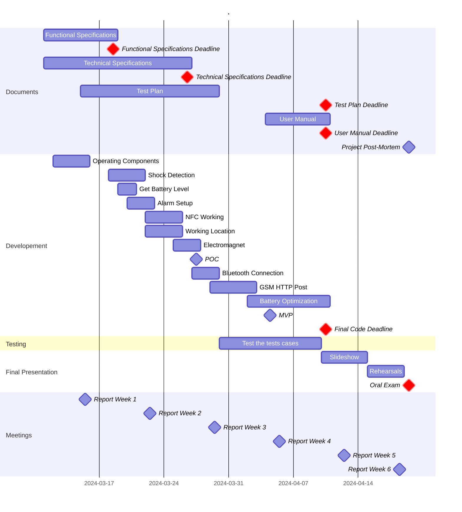

<!-- See: Docs/Specifications/FuncSpecs-Helper.md -->

# Functional Specifications

---
**Title:** SportShield - Team 3

**Author:** Pierre GORIN

**Team:** Team 3

**Reviewer:** Salaheddine NAMIR

**Created on:** March 11th, 2024

**Last updated:** March 13th, 2024

---

### Approvals

| Reviewer          | Role              | Approved | Date |
| ----------------- | ----------------- | -------- | ---- |
| Salaheddine NAMIR | Quality Assurance |          |      |
| Mouatassime SEIV  | Project Manager   |          |      |
| Pierre GORIN      | Program Manager   |          |      |
| Abderrazaq MAKRAN | Technical Lead    |          |      |
| Michel RIFF       | Technical Writer  |          |      |
| Guillaume DESPAUX | Software Engineer |          |      |

 

<h2 id="toc"> Table of Contents <i>(Click to expand)</i></h2>

- [Functional Specifications](#functional-specifications)
    - [Approvals](#approvals)
- [1. - Glossary](#1---glossary)
- [2. - Introduction](#2---introduction)
  - [2.1 - Overview](#21---overview)
  - [2.2 - Project Definition](#22---project-definition)
    - [2.2.1 - Purpose](#221---purpose)
    - [2.2.2 - Scope](#222---scope)
    - [2.2.3 - Deliverables](#223---deliverables)
  - [2.3 - Project Organization](#23---project-organization)
    - [2.3.1 - Project Representatives](#231---project-representatives)
    - [2.3.2 - Stakeholders](#232---stakeholders)
    - [2.3.3 - Project Team](#233---project-team)
    - [2.3.4 - Project Reviewers](#234---project-reviewers)
  - [2.4 - Project Plan](#24---project-plan)
    - [2.4.1 - Retro-planning](#241---retro-planning)
    - [2.4.2 - Milestones](#242---milestones)
    - [2.4.3 - Resources](#243---resources)
    - [2.4.4 - Assumptions and Constraints](#244---assumptions-and-constraints)
- [3. - Personas](#3---personas)
  - [3.1 - Individual Sports Enthusiasts](#31---individual-sports-enthusiasts)
    - [3.1.1 - The Weekend Warrior](#311---the-weekend-warrior)
    - [3.1.2 - The Extreme Sports Adventurer](#312---the-extreme-sports-adventurer)
    - [3.1.3 - The Fitness Fanatic](#313---the-fitness-fanatic)
  - [3.2 - Professional Athletes and Performers](#32---professional-athletes-and-performers)
    - [3.2.1 - The Touring Musician](#321---the-touring-musician)
    - [3.2.2 - The Competitive Skier](#322---the-competitive-skier)
  - [3.3 - Outdoor and Travel Enthusiasts](#33---outdoor-and-travel-enthusiasts)
    - [3.3.1 - The Global Backpacker](#331---the-global-backpacker)
    - [3.3.2 - The Tech-Savvy Traveler](#332---the-tech-savvy-traveler)

# 1. - Glossary

| Term        | Definition                                        | More information                                                                    |
| ----------- | ------------------------------------------------- | ----------------------------------------------------------------------------------- |
| SportShield | The name of the device developed in this project. |                                                                                     |
| GNSS        | Global Navigation Satellite System.               | [here 🔗](https://en.wikipedia.org/wiki/Global_Navigation_Satellite_System)          |
| GPS         | Global Positioning System.                        | [here 🔗](https://en.wikipedia.org/wiki/Global_Positioning_System)                   |
| GSM         | Global System for Mobile Communications.          | [here 🔗](https://en.wikipedia.org/wiki/GSM)                                         |
| GPRS        | General Packet Radio Service.                     | [here 🔗](https://en.wikipedia.org/wiki/General_Packet_Radio_Service)                |
| BLE         | Bluetooth Low Energy.                             | [here 🔗](https://en.wikipedia.org/wiki/Bluetooth_Low_Energy)                        |
| NFC         | Near Field Communication.                         | [here 🔗](https://en.wikipedia.org/wiki/Near-field_communication)                    |
| API         | Application Programming Interface.                | [here 🔗](https://en.wikipedia.org/wiki/Application_programming_interface)           |
| HTTP        | Hypertext Transfer Protocol.                      | [here 🔗](https://en.wikipedia.org/wiki/Hypertext_Transfer_Protocol)                 |
| DOF         | Degrees of Freedom.                               | [here 🔗](https://en.wikipedia.org/wiki/Degrees_of_freedom)                          |
| IMU         | Inertial Measurement Unit.                        | [here 🔗](https://en.wikipedia.org/wiki/Inertial_measurement_unit)                   |
| GPIO        | General Purpose Input/Output.                     | [here 🔗](https://en.wikipedia.org/wiki/General-purpose_input/output)                |
| UART        | Universal Asynchronous Receiver-Transmitter.      | [here 🔗](https://en.wikipedia.org/wiki/Universal_asynchronous_receiver-transmitter) |
| I2C         | Inter-Integrated Circuit.                         | [here 🔗](https://en.wikipedia.org/wiki/I%C2%B2C)                                    |
| SPI         | Serial Peripheral Interface.                      | [here 🔗](https://en.wikipedia.org/wiki/Serial_Peripheral_Interface)                 |

# 2. - Introduction

## 2.1 - Overview

## 2.2 - Project Definition

### 2.2.1 - Purpose

The Goals and Objectives of this project is to work on the development of the SportShield device. The SportShield device is a lockspan powered by a microcontroller and equipped with a set of sensors and a communication module. The device is designed to be attached to a sports equipment, such as a pair of skis, a snowboard, a bike, a surf, etc. The device is intended to provide the user with a set of features to protect the equipment from theft and to monitor the equipment's status.

This Project is piloted by the company [Coris Innovation](https://www.corisinnovation.com/), A company founded in 2015 by Stéphane MAIGE and specialized in the development of innovative products in many fields like Aerospace, Automotive, Energy, Railway, Pharmaceutical, Watchmaking, etc...
Coris Innovation is made of a team of 90 employees spreaded over 5 sites in France and Switzerland.

### 2.2.2 - Scope

| Feature             | Description                                                                           | In Scope | Out of Scope |
| ------------------- | ------------------------------------------------------------------------------------- | -------- | ------------ |
| GPS Tracking        | The device must be able to provide the user with the GPS coordinates of the equipment | ✅        |              |
| Alarm               | The device must be able to trigger an alarm when the equipment is moved               | ✅        |              |
| Remote Locking      | The device must be able to lock the equipment remotely                                | ✅        |              |
| Remote Unlocking    | The device must be able to unlock the equipment remotely                              | ✅        |              |
| Battery Monitoring  | The device must be able to monitor its battery level                                  | ✅        |              |
| Communication       | The device must be able to communicate with a smartphone                              | ✅        |              |
| User Interface      | The device must be able to provide the user with a user interface                     |          | ❌            |
| User Authentication | The device must be able to authenticate the user                                      |          | ❌            |

### 2.2.3 - Deliverables

The deliverables of this project are:

| Deliverable               | Link to the Document                                        |
| ------------------------- | ----------------------------------------------------------- |
| Functional Specifications | [Functional Specifications](./Functional-Specifications.md) |
| Technical Specifications  | [Technical Specifications](./Technical-Specifications.md)   |
| Test Plan                 | [Test Plan](./Test-Plan.md)                                 |
| User Manual               | [User Manual](./User-Manual.md)                             |
| Code                      | [Code](../../Src/New/main.ino)                              |

## 2.3 - Project Organization

### 2.3.1 - Project Representatives

| Owners                 | Representative                                |
| ---------------------- | --------------------------------------------- |
| ***Coris Innovation*** | Represented by ***Florent ANON***             |
| ***ALGOSUP***          | Represented by ***Franck JEANNIN***           |
| Mouatassime SEIV       | Represented by Pierre GORIN (Program Manager) |

The project sponsors (highlighted in ***bold italic***) are expected to be in charge of:

- Defining the vision and high-level objectives for the project.
- Approving the requirements, timetable and resources.
- Authorising the provision of funds/resources.
- Approving the Functional and Technical Specifications written by the team.
- Approving any major changes in scope.
- Approving the Test Plan and User Manual written by the team.
- Received Project Weekly Reports and take action accordingly to resolve issues escalated by the Project Manager.
- Providing final acceptance of the solution upon project completion.

### 2.3.2 - Stakeholders

| Stakeholder      | Interest                                                                  |
| ---------------- | ------------------------------------------------------------------------- |
| Coris Innovation | The company that initiate the project and will sell the device            |
| ALGOSUP          | The company that will help on the development of the software             |
| Students         | The team that will work on the development and optimization of the device |
| End Users        | The people that will use the device                                       |

### 2.3.3 - Project Team

| Role              | Description                                                                                                                                                                                                                    | Name              |
| ----------------- | ------------------------------------------------------------------------------------------------------------------------------------------------------------------------------------------------------------------------------ | ----------------- |
| Project Manager   | • He is in charge of organization, planning, and budgeting. • Ensure communication within the team and keep them motivated.                                                                                                 | Mouatassime SEIV  |
| Program Manager   | • Makes sure the project meets the client's expectations. • He is the intermediary between the client and the development team. • He is responsible for writing the Functional Specifications.                           | Pierre GORIN      |
| Technical Lead    | • He is in charge of making the technical decisions in the project. • He translates the Functional Specifications into Technical Specifications.                                                                            | Abderrazaq MAKRAN |
| Technical Writer  | • He is in charge of writing the documentation of the project. • Based on the specifications, he writes a Manual for the end-users.                                                                                         | Michel RIFF       |
| Software Engineer | • Responsible for Writing the code and the unit tests, commenting, and documenting his code. • He participates in the technical choices.                                                                                    | Guillaume DESPAUX |
| Quality Assurance | • Tests all the functionalities of the product to find bugs and issues. Defines the test strategy and writes the test plan. • He documents all the encountered bugs and issues, then checks that the errors are well fixed. | Salaheddine NAMIR |

### 2.3.4 - Project Reviewers

External project reviewers have been appointed by the project owner to review our specifications and provide us with feedback.

## 2.4 - Project Plan

### 2.4.1 - Retro-planning

The project will be developped in 6 weeks, from the 11th March 2024 to the 19th April 2024.

### 2.4.2 - Milestones

| n°  | Milestone                      | Date       |     | n°  | Milestone           | Date       |
| --- | ------------------------------ | ---------- | --- | --- | ------------------- | ---------- |
| 1   | First Week Report              | 03/15/2024 |     | 8   | Fourth Week Report  | 04/05/2024 |
| 2   | Functional Specifications (v1) | 03/18/2024 |     | 9   | Test Plan           | 04/10/2024 |
| 3   | Second Week Report             | 03/22/2024 |     | 10  | User Manual         | 04/10/2024 |
| 4   | Technical Specifications (v1)  | 03/26/2024 |     | 11  | Final Code          | 04/10/2024 |
| 5   | POC (Proof of Concept)         | 03/27/2024 |     | 12  | Fifth Week Report   | 04/12/2024 |
| 6   | Third Week Report              | 03/29/2024 |     | 13  | Final Presentation  | 04/19/2024 |
| 7   | MVP (Minimum Viable Product)   | 04/04/2024 |     | 14  | Project Post-Mortem | 04/19/2024 |    

### 2.4.3 - Resources

- The team (6 people).
- We estimate 504 hours of work for the whole team *(6 weeks * 6 people * 2 days * 7 hours/day = 504 hours)*.
- The books from the ALGOSUP's library.
- Teachers and professionals from ALGOSUP.
- The Original Source Code of the device.
- The Hardware of the device.
  - The microcontroller,
  - GNSS module,
  - GSM module,
  - Electromagnet,
  - Buzzer,
  - Battery,
  - NFC antenna,
  - USB-C connector.
- The following documentation:
  - SIM800L Hardware Design v2.02 (GSM module),
  - LP603449 Battery Datasheet (Battery),
  - CD-PA1010D Satasheet v02 (GNSS module),
  - Xiao nRF52840 Product Specification v1.5 (Microcontroller),
  - Xiao nRF52840 Blueprints v1.1 (Microcontroller),
  - SportShield Electronic Schematic v2 (Device).
- The following Libraries:
  - NRF52_MBED_TimerInterrupt V1.4.1
  - ArduinoBLE V1.3.6
  - Adafruit GPS Library V1.7.4
  - Sim800L http connector V1.14.0
  - Seeed Arduino LSM6DS3 V2.0.3
  - OneWire V2.3.7

### 2.4.4 - Assumptions and Constraints

# 3. - Personas

## 3.1 - Individual Sports Enthusiasts

### 3.1.1 - The Weekend Warrior

### 3.1.2 - The Extreme Sports Adventurer

### 3.1.3 - The Fitness Fanatic

## 3.2 - Professional Athletes and Performers

### 3.2.1 - The Touring Musician

### 3.2.2 - The Competitive Skier

## 3.3 - Outdoor and Travel Enthusiasts

### 3.3.1 - The Global Backpacker

### 3.3.2 - The Tech-Savvy Traveler