<!-- See: Docs/Specifications/FuncSpecs-Helper.md -->

# Functional Specifications

---
**Title:** SportShield - Team 3

**Author:** Pierre GORIN

**Team:** Team 3

**Reviewer:** Salaheddine NAMIR

**Created on:** March 11th, 2024

**Last updated:** March 15th, 2024

---

### Approvals

| Reviewer          | Role              | Approved | Date |
| ----------------- | ----------------- | -------- | ---- |
| Salaheddine NAMIR | Quality Assurance |          |      |
| Mouatassime SEIV  | Project Manager   |          |      |
| Pierre GORIN      | Program Manager   |          |      |
| Abderrazaq MAKRAN | Technical Lead    |          |      |
| Michel RIFF       | Technical Writer  |          |      |
| Guillaume DESPAUX | Software Engineer |          |      |

 

<h2 id="toc"> Table of Contents <i>(Click to expand)</i></h2>

- [Functional Specifications](#functional-specifications)
    - [Approvals](#approvals)
- [1. - Glossary](#1---glossary)
- [2. - Introduction](#2---introduction)
  - [2.1 - Overview](#21---overview)
  - [2.2 - Project Definition](#22---project-definition)
    - [2.2.1 - Purpose](#221---purpose)
    - [2.2.2 - Scope](#222---scope)
    - [2.2.3 - Deliverables](#223---deliverables)
  - [2.3 - Project Organization](#23---project-organization)
    - [2.3.1 - Project Representatives](#231---project-representatives)
    - [2.3.2 - Stakeholders](#232---stakeholders)
    - [2.3.3 - Project Team](#233---project-team)
    - [2.3.4 - Project Reviewers](#234---project-reviewers)
  - [2.4 - Project Plan](#24---project-plan)
    - [2.4.1 - Retro-planning](#241---retro-planning)
    - [2.4.2 - Milestones](#242---milestones)
    - [2.4.3 - Resources](#243---resources)
    - [2.4.4 - Assumptions and Constraints](#244---assumptions-and-constraints)
- [3. - Personas](#3---personas)
  - [3.1 - Individual Sports Enthusiasts](#31---individual-sports-enthusiasts)
  - [3.2 - Professional Athletes and Performers](#32---professional-athletes-and-performers)
  - [3.3 - Outdoor and Travel Enthusiasts](#33---outdoor-and-travel-enthusiasts)
- [4. - The Uses Cases](#4---the-uses-cases)
  - [4.1 - Use Case List](#41---use-case-list)
  - [4.2 - Use Case Description](#42---use-case-description)
    - [4.2.1 - Pair the Device with the Mobile App.](#421---pair-the-device-with-the-mobile-app)
    - [4.2.2 - Add a Security Card to the Device.](#422---add-a-security-card-to-the-device)
    - [4.2.3 - Activate the Anti-Theft Protection using the Mobile App.](#423---activate-the-anti-theft-protection-using-the-mobile-app)
    - [4.2.4 - Activate the Anti-Theft Protection using the Security Card.](#424---activate-the-anti-theft-protection-using-the-security-card)
    - [4.2.5 - Deactivate the Anti-Theft Protection and Unlock the Device using the Mobile App.](#425---deactivate-the-anti-theft-protection-and-unlock-the-device-using-the-mobile-app)
    - [4.2.6 - Deactivate the Anti-Theft Protection and Unlock the Device using the Security Card.](#426---deactivate-the-anti-theft-protection-and-unlock-the-device-using-the-security-card)
    - [4.2.7 - Emit an Audible Alarm when a Light Shock is Detected.](#427---emit-an-audible-alarm-when-a-light-shock-is-detected)
    - [4.2.8 - Emit an Audible Alarm and Send a Notification when a Strong Shock is Detected.](#428---emit-an-audible-alarm-and-send-a-notification-when-a-strong-shock-is-detected)
    - [4.2.9 - Send GPS Coordinates and Battery Level to the API.](#429---send-gps-coordinates-and-battery-level-to-the-api)
    - [4.2.10 - Receive Notifications from the API.](#4210---receive-notifications-from-the-api)
    - [4.2.11 - Send a Notification when the Battery is Low.](#4211---send-a-notification-when-the-battery-is-low)
    - [4.2.12 - Send a Notification when the Battery is Full.](#4212---send-a-notification-when-the-battery-is-full)
    - [4.2.13 - Cut the Alarm with the Mobile App.](#4213---cut-the-alarm-with-the-mobile-app)
    - [4.2.14 - Cut the Alarm with the Security Card.](#4214---cut-the-alarm-with-the-security-card)
- [5. - Features](#5---features)
  - [5.1 - Features List](#51---features-list)
  - [5.2 - Features Description](#52---features-description)
    - [5.2.1 - Light Shock Detection](#521---light-shock-detection)
    - [5.2.2 - Strong Shock Detection](#522---strong-shock-detection)
    - [5.2.3 - Soft Alarm](#523---soft-alarm)
    - [5.2.4 - Loud Alarm](#524---loud-alarm)
    - [5.2.5 - Confirmation Sound](#525---confirmation-sound)
    - [5.2.6 - Bluetooth Connection Sound](#526---bluetooth-connection-sound)
    - [5.2.7 - Enter in Sleep Mode Sound](#527---enter-in-sleep-mode-sound)
    - [5.2.8 - Enter in Anti-Theft Mode Sound](#528---enter-in-anti-theft-mode-sound)
- [6. - Hardware and Libraries Used](#6---hardware-and-libraries-used)
  - [6.1 - Hardware](#61---hardware)
    - [6.1.1 - Microcontroller](#611---microcontroller)
    - [6.1.2 - GNSS Module](#612---gnss-module)
    - [6.1.3 - GSM Module](#613---gsm-module)
    - [6.1.4 - Electromagnet](#614---electromagnet)
    - [6.1.5 - Buzzer](#615---buzzer)
    - [6.1.6 - Battery](#616---battery)
    - [6.1.7 - NFC Antenna](#617---nfc-antenna)
  - [6.2 - Libraries](#62---libraries)
    - [6.2.1 - NRF52\_MBED\_TimerInterrupt V1.4.1](#621---nrf52_mbed_timerinterrupt-v141)
    - [6.2.2 - ArduinoBLE V1.3.6](#622---arduinoble-v136)
    - [6.2.3 - Adafruit GPS Library V1.7.4](#623---adafruit-gps-library-v174)
    - [6.2.4 - Sim800L http connector V1.14.0](#624---sim800l-http-connector-v1140)
    - [6.2.5 - Seeed Arduino LSM6DS3 V2.0.3](#625---seeed-arduino-lsm6ds3-v203)
    - [6.2.6 - OneWire V2.3.7](#626---onewire-v237)

# 1. - Glossary

| Term        | Definition                                        | More information                                                                    |
| ----------- | ------------------------------------------------- | ----------------------------------------------------------------------------------- |
| SportShield | The name of the device developed in this project. |                                                                                     |
| GNSS        | Global Navigation Satellite System.               | [here 🔗](https://en.wikipedia.org/wiki/Global_Navigation_Satellite_System)          |
| GPS         | Global Positioning System.                        | [here 🔗](https://en.wikipedia.org/wiki/Global_Positioning_System)                   |
| GSM         | Global System for Mobile Communications.          | [here 🔗](https://en.wikipedia.org/wiki/GSM)                                         |
| GPRS        | General Packet Radio Service.                     | [here 🔗](https://en.wikipedia.org/wiki/General_Packet_Radio_Service)                |
| BLE         | Bluetooth Low Energy.                             | [here 🔗](https://en.wikipedia.org/wiki/Bluetooth_Low_Energy)                        |
| NFC         | Near Field Communication.                         | [here 🔗](https://en.wikipedia.org/wiki/Near-field_communication)                    |
| API         | Application Programming Interface.                | [here 🔗](https://en.wikipedia.org/wiki/Application_programming_interface)           |
| HTTP        | Hypertext Transfer Protocol.                      | [here 🔗](https://en.wikipedia.org/wiki/Hypertext_Transfer_Protocol)                 |
| DOF         | Degrees of Freedom.                               | [here 🔗](https://en.wikipedia.org/wiki/Degrees_of_freedom)                          |
| IMU         | Inertial Measurement Unit.                        | [here 🔗](https://en.wikipedia.org/wiki/Inertial_measurement_unit)                   |
| GPIO        | General Purpose Input/Output.                     | [here 🔗](https://en.wikipedia.org/wiki/General-purpose_input/output)                |
| UART        | Universal Asynchronous Receiver-Transmitter.      | [here 🔗](https://en.wikipedia.org/wiki/Universal_asynchronous_receiver-transmitter) |
| I2C         | Inter-Integrated Circuit.                         | [here 🔗](https://en.wikipedia.org/wiki/I%C2%B2C)                                    |
| SPI         | Serial Peripheral Interface.                      | [here 🔗](https://en.wikipedia.org/wiki/Serial_Peripheral_Interface)                 |

# 2. - Introduction

## 2.1 - Overview

## 2.2 - Project Definition

### 2.2.1 - Purpose

The Goals and Objectives of this project is to work on the development of the SportShield device. The SportShield device is a lockspan powered by a microcontroller and equipped with a set of sensors and a communication module. The device is designed to be attached to a sports equipment, such as a pair of skis, a snowboard, a bike, a surf, etc. The device is intended to provide the user with a set of features to protect the equipment from theft and to monitor the equipment's status.

This Project is piloted by the company [Coris Innovation](https://www.corisinnovation.com/), A company founded in 2015 by [Stéphane MAIGE](https://www.linkedin.com/in/st%C3%A9phane-maige-37710613/) and specialized in the development of innovative products in many fields like Aerospace, Automotive, Energy, Railway, Pharmaceutical, Watchmaking, etc...
Coris Innovation is made of a team of 90 employees spreaded over 5 sites in France and Switzerland.

### 2.2.2 - Scope

| Feature             | Description                                                                           | In Scope | Out of Scope |
| ------------------- | ------------------------------------------------------------------------------------- | -------- | ------------ |
| GPS Tracking        | The device must be able to provide the user with the GPS coordinates of the equipment | ✅        |              |
| Alarm               | The device must be able to trigger an alarm when the equipment is moved               | ✅        |              |
| Remote Locking      | The device must be able to lock the equipment remotely                                | ✅        |              |
| Remote Unlocking    | The device must be able to unlock the equipment remotely                              | ✅        |              |
| Battery Monitoring  | The device must be able to monitor its battery level                                  | ✅        |              |
| Communication       | The device must be able to communicate with a smartphone                              | ✅        |              |
| User Interface      | The device must be able to provide the user with a user interface                     |          | ❌            |
| User Authentication | The device must be able to authenticate the user                                      |          | ❌            |

### 2.2.3 - Deliverables

The deliverables of this project are:

| Deliverable               | Link to the Document                                        |
| ------------------------- | ----------------------------------------------------------- |
| Functional Specifications | [Functional Specifications](./Functional-Specifications.md) |
| Technical Specifications  | [Technical Specifications](./Technical-Specifications.md)   |
| Test Plan                 | [Test Plan](./Test-Plan.md)                                 |
| User Manual               | [User Manual](./User-Manual.md)                             |
| Code                      | [Code](../../Src/New/main.ino)                              |

## 2.3 - Project Organization

### 2.3.1 - Project Representatives

| Owners                                                                     | Representative                                                                                         |
| -------------------------------------------------------------------------- | ------------------------------------------------------------------------------------------------------ |
| ***[Coris Innovation](https://www.corisinnovation.com)***                  | Represented by ***[Florent ANON](https://www.linkedin.com/in/florentanon/)***                          |
| ***[ALGOSUP](https://www.algosup.com)***                                   | Represented by ***[Franck JEANNIN](https://www.linkedin.com/in/franck-jeannin/)***                     |
| [Mouatassime SEIV](https://www.linkedin.com/in/moutassime-seiv-9542171a9/) | Represented by [Pierre GORIN](https://www.linkedin.com/in/pierre-gorin-61a784221/  ) (Program Manager) |

The project sponsors (highlighted in ***bold italic***) are expected to be in charge of:

- Defining the vision and high-level objectives for the project.
- Approving the requirements, timetable and resources.
- Authorising the provision of funds/resources.
- Approving the Functional and Technical Specifications written by the team.
- Approving any major changes in scope.
- Approving the Test Plan and User Manual written by the team.
- Received Project Weekly Reports and take action accordingly to resolve issues escalated by the Project Manager.
- Providing final acceptance of the solution upon project completion.

### 2.3.2 - Stakeholders

| Stakeholder      | Interest                                                                  |
| ---------------- | ------------------------------------------------------------------------- |
| Coris Innovation | The company that initiate the project and will sell the device            |
| ALGOSUP          | The company that will help on the development of the software             |
| Students         | The team that will work on the development and optimization of the device |
| End Users        | The people that will use the device                                       |

### 2.3.3 - Project Team

| Role              | Description                                                                                                                                                                                                                    | Name                                                     |
| ----------------- | ------------------------------------------------------------------------------------------------------------------------------------------------------------------------------------------------------------------------------ | -------------------------------------------------------- |
| Project Manager   | • He is in charge of organization, planning, and budgeting. • Ensure communication within the team and keep them motivated.                                                                                                 | [Mouatassime SEIV](https://github.com/seiv007)           |
| Program Manager   | • Makes sure the project meets the client's expectations. • He is the intermediary between the client and the development team. • He is responsible for writing the Functional Specifications.                           | [Pierre GORIN](https://github.com/Pierre2103)            |
| Technical Lead    | • He is in charge of making the technical decisions in the project. • He translates the Functional Specifications into Technical Specifications.                                                                            | [Abderrazaq MAKRAN](https://github.com/Amakran2003)      |
| Technical Writer  | • He is in charge of writing the documentation of the project. • Based on the specifications, he writes a Manual for the end-users.                                                                                         | [Michel RIFF](https://github.com/MichelRiff)             |
| Software Engineer | • Responsible for Writing the code and the unit tests, commenting, and documenting his code. • He participates in the technical choices.                                                                                    | [Guillaume DESPAUX](https://github.com/GuillaumeDespaux) |
| Quality Assurance | • Tests all the functionalities of the product to find bugs and issues. Defines the test strategy and writes the test plan. • He documents all the encountered bugs and issues, then checks that the errors are well fixed. | [Salaheddine NAMIR](https://github.com/T3rryc)           |

### 2.3.4 - Project Reviewers

External project reviewers have been appointed by the project owner to review our specifications and provide us with feedback.

## 2.4 - Project Plan

### 2.4.1 - Retro-planning

The project will be developped in 6 weeks, from the 11th March 2024 to the 19th April 2024.

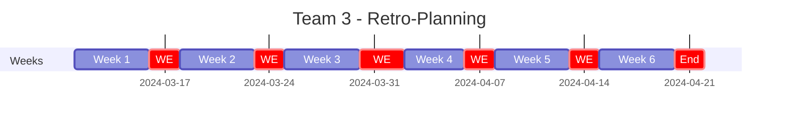

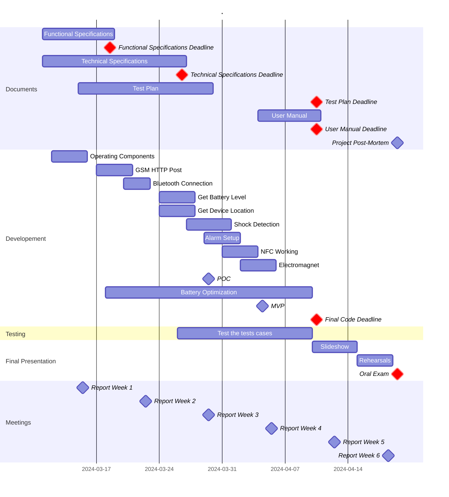

### 2.4.2 - Milestones

| n°  | Milestone                      | Date       |     | n°  | Milestone           | Date       |
| --- | ------------------------------ | ---------- | --- | --- | ------------------- | ---------- |
| 1   | First Week Report              | 03/15/2024 |     | 8   | Fourth Week Report  | 04/05/2024 |
| 2   | Functional Specifications (v1) | 03/18/2024 |     | 9   | Test Plan           | 04/10/2024 |
| 3   | Second Week Report             | 03/22/2024 |     | 10  | User Manual         | 04/10/2024 |
| 4   | Technical Specifications (v1)  | 03/26/2024 |     | 11  | Final Code          | 04/10/2024 |
| 5   | POC (Proof of Concept)         | 03/29/2024 |     | 12  | Fifth Week Report   | 04/12/2024 |
| 6   | Third Week Report              | 03/29/2024 |     | 13  | Final Presentation  | 04/19/2024 |
| 7   | MVP (Minimum Viable Product)   | 04/04/2024 |     | 14  | Project Post-Mortem | 04/19/2024 |

### 2.4.3 - Resources

- The team (6 people).
- We estimate **504 hours of work** for the whole team *(6 weeks * 6 people * 2 days * 7 hours/day = 504 hours)*.
- The books from the ALGOSUP's library.
- Teachers and professionals from ALGOSUP.
- The Original Source Code of the device.
- The Hardware of the device.
  - The microcontroller,
  - GNSS module,
  - GSM module,
  - Electromagnet,
  - Buzzer,
  - Battery,
  - NFC antenna,
  - USB-C connector.
- The following documentation:
  - [SIM800L Hardware Design v2.02 (GSM module)](../Hardware/SIM800L-SIMCom.pdf),
  - [LP603449 Battery Datasheet (Battery)](../Hardware/Batterie_LP603449.pdf),
  - [CD-PA1010D Satasheet v02 (GNSS module)](../Hardware/CD-PA1010D-Datasheet-v.02.pdf),
  - [Xiao nRF52840 Product Specification v1.5 (Microcontroller)](../Hardware/nRF52840_PS_v1.5.pdf),
  - [Xiao nRF52840 Blueprints v1.1 (Microcontroller)](../Hardware/Seeed-Studio-XIAO-nRF52840-Sense-v1.1.pdf),
  - [SportShield Electronic Schematic v2 (Device)](../Hardware/SportShield%20-%20Electronics%20diagram.png).
- The following Libraries:
  - NRF52_MBED_TimerInterrupt V1.4.1
  - ArduinoBLE V1.3.6
  - Adafruit GPS Library V1.7.4
  - Sim800L http connector V1.14.0
  - Seeed Arduino LSM6DS3 V2.0.3
  - OneWire V2.3.7
- The Following Tools:
  - Arduino IDE,
  - Visual Studio Code,
  - GitHub,
  - NFC Tools,
  - LightBlue.

### 2.4.4 - Assumptions and Constraints

**Assumptions:**
- The device will be used by people who are familiar with technology.
- The device will be used in a place where the GSM and GPS signals are available.
- The device will be powered by a 3.7V battery with a capacity of 1100mAh.
- We assume that the device will be used in an environment where the temperature is between -15°C and +45°C.
- We assume that the user will use the original USB-C.
- We assume that the user can buy a security card to use with the device.

**Constraints:**
- The device must be able to work for at least 7 days without being recharged.
- The device must distinguish between a legitimate movement and a theft attempt.
- The device must be able to communicate with a smartphone using Bluetooth Low Energy (BLE).
- The device must be able to communicate with a server using the GSM module.
- The device must be able to send the GPS coordinates and battery level to the server using the GSM module.
- The device must be able to lock and unlock the equipment using an electromagnet.
- All the components of the device must be powered by the battery.

# 3. - Personas

## 3.1 - Individual Sports Enthusiasts

| The Weekend Warrior                                                                                                                                                                                                       | The Extreme Sports Adventurer                                                                                                                                          | The Fitness Fanatic                                                                                                                                                               |
| ------------------------------------------------------------------------------------------------------------------------------------------------------------------------------------------------------------------------- | ---------------------------------------------------------------------------------------------------------------------------------------------------------------------- | --------------------------------------------------------------------------------------------------------------------------------------------------------------------------------- |
|                                                                                                                                                     |                                                                                      |                                                                                                            |
| **Name:** Liam Davis                                                                                                                                                                                                      | **Name:** Sophia Johnson                                                                                                                                               | **Name:** Elena Smith                                                                                                                                                             |
| **Age:** 43                                                                                                                                                                                                               | **Age:** 27                                                                                                                                                            | **Age:** 31                                                                                                                                                                       |
| **Occupation:** Accountant 👨‍💼                                                                                                                                                                                              | **Occupation:** Photographer 📸                                                                                                                                         | **Occupation:** Personal Trainer 🏋️‍♂️                                                                                                                                                |
| **Tech Savviness:** ⭐️⭐️                                                                                                                                                                                                    | **Tech Savviness** ⭐️⭐️⭐️                                                                                                                                                 | **Tech Savviness** ⭐️⭐️⭐️⭐️                                                                                                                                                           |
| **Liam** loves to spend his weekends outside, doing things like skiing, biking, or surfing. He's not very into tech, but **SportShield** is easy for him to use. It keeps his sports stuff safe when he's taking a break. | **Sophia** travels a lot to do exciting sports. She likes **SportShield** because it's strong and keeps her equipment safe everywhere she goes, no matter the weather. | **Elena** is always moving, from the gym to outdoor workouts. She likes **SportShield** because it's easy to use with her phone and it keeps her things safe while she exercises. |

*All images were created using the Dall-E 3 AI generative model.*

## 3.2 - Professional Athletes and Performers

| The Touring Musician                                                                                                                                                                                 | The Competitive Skier                                                                                                                                       | The Professional Cyclist                                                                                                                                           |
| ---------------------------------------------------------------------------------------------------------------------------------------------------------------------------------------------------- | ----------------------------------------------------------------------------------------------------------------------------------------------------------- | ------------------------------------------------------------------------------------------------------------------------------------------------------------------ |
|                                                                                                                               |                                                                                 |                                                                                       |
| **Name:** Noah Miller                                                                                                                                                                                | **Name:** Isabella Williams                                                                                                                                 | **Name:** Oliver Wilson                                                                                                                                            |
| **Age:** 39                                                                                                                                                                                          | **Age:** 26                                                                                                                                                 | **Age:** 36                                                                                                                                                        |
| **Occupation:** Musician 🎸                                                                                                                                                                           | **Occupation:** Ski Instructor 🎿                                                                                                                            | **Occupation:** Cyclist 🚴🏻‍♂️                                                                                                                                          |
| **Tech Savviness** ⭐️⭐️                                                                                                                                                                                | **Tech Savviness** ⭐️⭐️⭐️⭐️                                                                                                                                     | **Tech Savviness** ⭐️⭐️⭐️⭐️⭐️                                                                                                                                           |
| **Noah** goes to different places to play music. He likes **SportShield** because it keeps his instruments safe, especially when he's busy. It's easy for him to check on his things with his phone. | **Isabella** races and teaches skiing. She uses **SportShield** to keep her ski gear safe. It has an alarm and can tell if someone tries to move her stuff. | **Oliver** rides bikes in races. He likes **SportShield** because it can track his bike and tell him if someone tries to take it. It helps him keep his bike safe. |

*All images were created using the Dall-E 3 AI generative model.*

## 3.3 - Outdoor and Travel Enthusiasts

| The Global Backpacker                                                                                                                                             | The Tech-Savvy Traveler                                                                                                                                                  | The Van Life Nomad                                                                                                                                            |
| ----------------------------------------------------------------------------------------------------------------------------------------------------------------- | ------------------------------------------------------------------------------------------------------------------------------------------------------------------------ | ------------------------------------------------------------------------------------------------------------------------------------------------------------- |
|                                                                                            |                                                                                                 |                                                                                         |
| **Name:** Ava Brown                                                                                                                                               | **Name:** Mia Jones                                                                                                                                                      | **Name:** Ethan Moore                                                                                                                                         |
| **Age:** 21                                                                                                                                                       | **Age:** 27                                                                                                                                                              | **Age:** 32                                                                                                                                                   |
| **Occupation:** Student 🎓                                                                                                                                         | **Occupation:** Software Engineer 👨‍💻                                                                                                                                      | **Occupation:** Freelancer 🧑‍💻                                                                                                                                  |
| **Tech Savviness** ⭐️⭐️⭐️⭐️⭐️                                                                                                                                          | **Tech Savviness** ⭐️⭐️⭐️⭐️⭐️                                                                                                                                                 | **Tech Savviness** ⭐️⭐️⭐️⭐️⭐️                                                                                                                                      |
| **Ava** loves to travel and see new places. She uses **SportShield** to keep her things safe. It's small and works with her phone, so it's perfect for her trips. | **Mia** loves tech and travel. She likes **SportShield** because it has smart features. She can check where her stuff is with her phone, which is great for her travels. | **Ethan** lives and works in his van. He likes **SportShield** because it's strong and smart. It keeps his work stuff and other things safe wherever he goes. |

*All images were created using the Dall-E 3 AI generative model.*

# 4. - The Uses Cases

## 4.1 - Use Case List

| ID                                                                                             | Use Case Name                                                                       |
| ---------------------------------------------------------------------------------------------- | ----------------------------------------------------------------------------------- |
| [1](#421---pair-the-device-with-the-mobile-app)                                                | Pair the Device with the Mobile App.                                                |
| [2](#422---add-a-security-card-to-the-device)                                                  | Add a Security Card to the Device.                                                  |
| [3](#423---activate-the-anti-theft-protection-using-the-mobile-app)                            | Activate the Anti-Theft Protection using the Mobile App.                            |
| [4](#424---activate-the-anti-theft-protection-using-the-security-card)                         | Activate the Anti-Theft Protection using the Security Card.                         |
| [5](#425---deactivate-the-anti-theft-protection-and-unlock-the-device-using-the-mobile-app)    | Deactivate the Anti-Theft Protection and Unlock the Device using the Mobile App.    |
| [6](#426---deactivate-the-anti-theft-protection-and-unlock-the-device-using-the-security-card) | Deactivate the Anti-Theft Protection and Unlock the Device using the Security Card. |
| [7](#427---emit-an-audible-alarm-when-a-light-shock-is-detected)                               | Emit an Audible Alarm when a Light Shock is Detected.                               |
| [8](#428---emit-an-audible-alarm-and-send-a-notification-when-a-strong-shock-is-detected)      | Emit an Audible Alarm and Send a Notification when a Strong Shock is Detected.      |
| [9](#429---send-gps-coordinates-and-battery-level-to-the-api)                                  | Send GPS Coordinates and Battery Level to the API.                                  |
| [10](#4210---receive-notifications-from-the-api)                                               | Receive Notifications from the API.                                                 |
| [11](#4211---send-a-notification-when-the-battery-is-low)                                      | Send a Notification when the Battery is Low.                                        |
| [12](#4212---send-a-notification-when-the-battery-is-full)                                     | Send a Notification when the Battery is Full.                                       |
| [13](#4213---cut-the-alarm-with-the-mobile-app)                                                | Cut the Alarm with the Mobile App.                                                  |
| [14](#4214---cut-the-alarm-with-the-security-card)                                             | Cut the Alarm with the Security Card.                                               |

## 4.2 - Use Case Description

### 4.2.1 - Pair the Device with the Mobile App.

| Use Case Name       | Pair the Device with the Mobile App.                                                                                                                                                                                                                                   |
| ------------------- | ---------------------------------------------------------------------------------------------------------------------------------------------------------------------------------------------------------------------------------------------------------------------- |
| **Actors**          | User, SportShield Device, Mobile App                                                                                                                                                                                                                                   |
| **Description**     | The user wants to pair the device with the mobile app.                                                                                                                                                                                                                 |
| **Pre-conditions**  | The device is powered on and the mobile app is installed on the user's smartphone.                                                                                                                                                                                     |
| **Post-conditions** | The device is paired with the mobile app.                                                                                                                                                                                                                              |
| **Normal Flow**     | 1. The user opens the mobile app. 2. The user clicks on the "Pair Device" button. 3. The mobile app scans for the device. 4. The mobile app finds the device and pairs with it. 5. The mobile app displays a message to confirm that the device is paired. |

### 4.2.2 - Add a Security Card to the Device.

| Use Case Name       | Add a Security Card to the Device.                                                                                                                                                                                                                                                                                                                                                                                                         |
| ------------------- | ------------------------------------------------------------------------------------------------------------------------------------------------------------------------------------------------------------------------------------------------------------------------------------------------------------------------------------------------------------------------------------------------------------------------------------------ |
| **Actors**          | User, SportShield Device, Mobile App, Security Card                                                                                                                                                                                                                                                                                                                                                                                        |
| **Description**     | The user wants to add a security card to the device.                                                                                                                                                                                                                                                                                                                                                                                       |
| **Pre-conditions**  | The device is paired with the mobile app.                                                                                                                                                                                                                                                                                                                                                                                                  |
| **Post-conditions** | The security card is added to the device.                                                                                                                                                                                                                                                                                                                                                                                                  |
| **Normal Flow**     | 1. The user opens the mobile app. 2. The user clicks on the "Add Security Card" button. 3. The mobile app displays a message to ask the user to present the security card to the device. 4. The user presents the security card to the device. 5. The device reads the security card and adds it to its list of authorized security cards. 6. The mobile app displays a message to confirm that the security card is added. |

### 4.2.3 - Activate the Anti-Theft Protection using the Mobile App.

| Use Case Name       | Activate the Anti-Theft Protection using the Mobile App.                                                                                                                                                                                                                                                                                                                                           |
| ------------------- | -------------------------------------------------------------------------------------------------------------------------------------------------------------------------------------------------------------------------------------------------------------------------------------------------------------------------------------------------------------------------------------------------- |
| **Actors**          | User, SportShield Device, Mobile App                                                                                                                                                                                                                                                                                                                                                               |
| **Description**     | The user wants to activate the anti-theft protection using the mobile app.                                                                                                                                                                                                                                                                                                                         |
| **Pre-conditions**  | The device is paired with the mobile app.                                                                                                                                                                                                                                                                                                                                                          |
| **Post-conditions** | The anti-theft protection is activated.                                                                                                                                                                                                                                                                                                                                                            |
| **Normal Flow**     | 1. The user opens the mobile app. 2. The user clicks on the "Activate Anti-Theft Protection" button. 3. The mobile app sends a command to the device to activate the anti-theft protection. 4. The device activates the anti-theft protection and sends a confirmation to the mobile app. 5. The mobile app displays a message to confirm that the anti-theft protection is activated. |

### 4.2.4 - Activate the Anti-Theft Protection using the Security Card.

| Use Case Name       | Activate the Anti-Theft Protection using the Security Card.                                                                                                                                   |
| ------------------- | --------------------------------------------------------------------------------------------------------------------------------------------------------------------------------------------- |
| **Actors**          | User, SportShield Device, Security Card                                                                                                                                                       |
| **Description**     | The user wants to activate the anti-theft protection using the security card.                                                                                                                 |
| **Pre-conditions**  | The security card is added to the device.                                                                                                                                                     |
| **Post-conditions** | The anti-theft protection is activated.                                                                                                                                                       |
| **Normal Flow**     | 1. The user presents the security card to the device. 2. The device reads the security card and activates the anti-theft protection. 3. The device play a sound to confirm to the user. |

### 4.2.5 - Deactivate the Anti-Theft Protection and Unlock the Device using the Mobile App.

| Use Case Name       | Deactivate the Anti-Theft Protection and Unlock the Device using the Mobile App.                                                                                                                                                                                                                                                                                                                                                                                                                                                                                                                                                                                                      |
| ------------------- | ------------------------------------------------------------------------------------------------------------------------------------------------------------------------------------------------------------------------------------------------------------------------------------------------------------------------------------------------------------------------------------------------------------------------------------------------------------------------------------------------------------------------------------------------------------------------------------------------------------------------------------------------------------------------------------- |
| **Actors**          | User, SportShield Device, Mobile App                                                                                                                                                                                                                                                                                                                                                                                                                                                                                                                                                                                                                                                  |
| **Description**     | The user wants to deactivate the anti-theft protection and unlock the device using the mobile app.                                                                                                                                                                                                                                                                                                                                                                                                                                                                                                                                                                                    |
| **Pre-conditions**  | The device is paired with the mobile app and the anti-theft protection is activated.                                                                                                                                                                                                                                                                                                                                                                                                                                                                                                                                                                                                  |
| **Post-conditions** | The anti-theft protection is deactivated and the device is unlocked.                                                                                                                                                                                                                                                                                                                                                                                                                                                                                                                                                                                                                  |
| **Normal Flow**     | 1. The user opens the mobile app. 2. The user clicks on the "Deactivate Anti-Theft Protection" button. 3. The mobile app sends a command to the device to deactivate the anti-theft protection. 4. The device deactivates the anti-theft protection and sends a confirmation to the mobile app. 5. The mobile app displays a message to confirm that the anti-theft protection is deactivated. 6. The user clicks on the "Unlock Device" button. 7. The mobile app sends a command to the device to unlock it. 8. The device unlocks and sends a confirmation to the mobile app. 9. The mobile app displays a message to confirm that the device is unlocked. |

### 4.2.6 - Deactivate the Anti-Theft Protection and Unlock the Device using the Security Card.

| Use Case Name       | Deactivate the Anti-Theft Protection and Unlock the Device using the Security Card.                                                                                                                                                                                                                                                                                             |
| ------------------- | ------------------------------------------------------------------------------------------------------------------------------------------------------------------------------------------------------------------------------------------------------------------------------------------------------------------------------------------------------------------------------- |
| **Actors**          | User, SportShield Device, Security Card                                                                                                                                                                                                                                                                                                                                         |
| **Description**     | The user wants to deactivate the anti-theft protection and unlock the device using the security card.                                                                                                                                                                                                                                                                           |
| **Pre-conditions**  | The security card is added to the device and the anti-theft protection is activated.                                                                                                                                                                                                                                                                                            |
| **Post-conditions** | The anti-theft protection is deactivated and the device is unlocked.                                                                                                                                                                                                                                                                                                            |
| **Normal Flow**     | 1. The user presents the security card to the device. 2. The device reads the security card and deactivates the anti-theft protection. 3. The device play a sound to confirm to the user. 4. The user presents the security card to the device. 5. The device reads the security card and unlocks the device. 6. The device play a sound to confirm to the user. |

### 4.2.7 - Emit an Audible Alarm when a Light Shock is Detected.

| Use Case Name       | Emit an Audible Alarm when a Light Shock is Detected.                     |
| ------------------- | ------------------------------------------------------------------------- |
| **Actors**          | User, SportShield Device                                                  |
| **Description**     | The device emits an audible alarm when a light shock is detected.         |
| **Pre-conditions**  | The anti-theft protection is activated.                                   |
| **Post-conditions** | An audible alarm is emitted.                                              |
| **Normal Flow**     | 1. The device detects a light shock. 2. The device emits a soft alarm. |

### 4.2.8 - Emit an Audible Alarm and Send a Notification when a Strong Shock is Detected.

| Use Case Name       | Emit an Audible Alarm and Send a Notification when a Strong Shock is Detected.                                                                                                                                                                                               |
| ------------------- | ---------------------------------------------------------------------------------------------------------------------------------------------------------------------------------------------------------------------------------------------------------------------------- |
| **Actors**          | User, SportShield Device, Mobile App, API                                                                                                                                                                                                                                    |
| **Description**     | The device emits an audible alarm and sends a notification when a strong shock is detected.                                                                                                                                                                                  |
| **Pre-conditions**  | The anti-theft protection is activated.                                                                                                                                                                                                                                      |
| **Post-conditions** | An audible alarm is emitted and a notification is sent.                                                                                                                                                                                                                      |
| **Normal Flow**     | 1. The device detects a strong shock. 2. The device emits a loud alarm. 3. The device sends a notification to the API. 4. The API sends a notification to the mobile app. 5. The mobile app displays a message with the location of the device to warn the user. |

### 4.2.9 - Send GPS Coordinates and Battery Level to the API.

| Use Case Name       | Send GPS Coordinates and Battery Level to the API.                    |
| ------------------- | --------------------------------------------------------------------- |
| **Actors**          | User, SportShield Device, Mobile App, API                             |
| **Description**     | The device sends the GPS coordinates and battery level to the API.    |
| **Pre-conditions**  | The device have battery                                               |
| **Post-conditions** | The GPS coordinates and battery level are sent to the API.            |
| **Normal Flow**     | 1. The device sends the GPS coordinates and battery level to the API. |

### 4.2.10 - Receive Notifications from the API.

| Use Case Name       | Receive Notifications from the API.                                                                                                                  |
| ------------------- | ---------------------------------------------------------------------------------------------------------------------------------------------------- |
| **Actors**          | User, SportShield Device, Mobile App, API                                                                                                            |
| **Description**     | The user receives notifications from the API.                                                                                                        |
| **Pre-conditions**  | The device is paired with the mobile app and the mobile app is connected to the API.                                                                 |
| **Post-conditions** | The user receives notifications from the API.                                                                                                        |
| **Normal Flow**     | 1. The API sends a notification to the mobile app. 2. The mobile app displays a message with the location and/or the battery level of the device. |

### 4.2.11 - Send a Notification when the Battery is Low.

| Use Case Name       | Send a Notification when the Battery is Low.                                                                                                                                                           |
| ------------------- | ------------------------------------------------------------------------------------------------------------------------------------------------------------------------------------------------------ |
| **Actors**          | User, SportShield Device, Mobile App, API                                                                                                                                                              |
| **Description**     | The device sends a notification when the battery is low.                                                                                                                                               |
| **Pre-conditions**  | The device have low battery                                                                                                                                                                            |
| **Post-conditions** | The user receives a notification from the API.                                                                                                                                                         |
| **Normal Flow**     | 1. The device detects a low battery. 2. The device sends a notification to the API. 3. The API sends a notification to the mobile app. 4. The mobile app displays a message to warn the user. |

### 4.2.12 - Send a Notification when the Battery is Full.

| Use Case Name       | Send a Notification when the Battery is Full.                                                                                                                                                             |
| ------------------- | --------------------------------------------------------------------------------------------------------------------------------------------------------------------------------------------------------- |
| **Actors**          | User, SportShield Device, Mobile App, API                                                                                                                                                                 |
| **Description**     | The device sends a notification when the battery is full.                                                                                                                                                 |
| **Pre-conditions**  | The device have full battery                                                                                                                                                                              |
| **Post-conditions** | The user receives a notification from the API.                                                                                                                                                            |
| **Normal Flow**     | 1. The device detects a full battery. 2. The device sends a notification to the API. 3. The API sends a notification to the mobile app. 4. The mobile app displays a message to inform the user. |

### 4.2.13 - Cut the Alarm with the Mobile App.

| Use Case Name       | Cut the Alarm with the Mobile App.                                                                                                                                                                                                                                                                            |
| ------------------- | ------------------------------------------------------------------------------------------------------------------------------------------------------------------------------------------------------------------------------------------------------------------------------------------------------------- |
| **Actors**          | User, SportShield Device, Mobile App                                                                                                                                                                                                                                                                          |
| **Description**     | The user wants to cut the alarm with the mobile app.                                                                                                                                                                                                                                                          |
| **Pre-conditions**  | The device is paired with the mobile app and the alarm is ringing.                                                                                                                                                                                                                                            |
| **Post-conditions** | The alarm is cut.                                                                                                                                                                                                                                                                                             |
| **Normal Flow**     | 1. The user opens the mobile app. 2. The user clicks on the "Cut Alarm" button. 3. The mobile app sends a command to the device to cut the alarm. 4. The device cuts the alarm and sends a confirmation to the mobile app. 5. The mobile app displays a message to confirm that the alarm is cut. |

### 4.2.14 - Cut the Alarm with the Security Card.

| Use Case Name       | Cut the Alarm with the Security Card.                                                                                                                                    |
| ------------------- | ------------------------------------------------------------------------------------------------------------------------------------------------------------------------ |
| **Actors**          | User, SportShield Device, Security Card                                                                                                                                  |
| **Description**     | The user wants to cut the alarm with the security card.                                                                                                                  |
| **Pre-conditions**  | The security card is added to the device and the alarm is ringing.                                                                                                       |
| **Post-conditions** | The alarm is cut.                                                                                                                                                        |
| **Normal Flow**     | 1. The user presents the security card to the device. 2. The device reads the security card and cuts the alarm. 3. The device play a sound to confirm to the user. |

# 5. - Features

## 5.1 - Features List

| Feature Name                   | Description                                            |
| ------------------------------ | ------------------------------------------------------ |
| Light Shock Detection          | Detect an involuntary movement.                        |
| Strong Shock Detection         | Detect a theft attempt.                                |
| Soft Alarm                     | Emit a 3 times low sound                               |
| Loud Alarm                     | Emit a 5 times high sound                              |
| Confirmation Sound             | Emit a sound to confirm the action.                    |
| Bluetooth Connected Sound      | Emit a sound when the device is connected.             |
| Enter in Sleep Mode Sound      | Emit a sound when the device enter in sleep mode.      |
| Enter in Anti-Theft Mode Sound | Emit a sound when the device enter in anti-theft mode. |
| GPS Coordinates                | Retrieve the GPS coordinates of the device.            |
| Battery Level                  | Retrieve the battery level of the device.              |
| GSM HTTP Post                  | Send a request to the API.                             |
| Notifications                  | Receive notifications from the API.                    |
| Low Battery Detection          | Detect when the battery is charged at 15% or less.     |
| Full Battery Detection         | Detect when the battery is charged at 100%.            |
| Alarm Cut                      | Cut the alarm even if there is ringing.                |
| Electromagnet                  | Lock and unlock the device.                            |
| Detect the Security Card       | Detect the security card.                              |
| Bluetooth Pairing              | Pair the device with the mobile app.                   |
| Send a command using BLE       | Send a command to the device using Bluetooth.          |
| Security Card Pairing          | Add a security card to the device.                     |
| Anti-Theft Protection          | Turn on the anti-theft protection.                     |
| Sleep Mode                     | Enter in a low power consumption mode.                 |

## 5.2 - Features Description

### 5.2.1 - Light Shock Detection

When a light shock is detected, the BLE will detect it using the Gyroscope and the Accelerometer. The device will emit a soft alarm to warn the user that a movement has been detected.

### 5.2.2 - Strong Shock Detection

When a strong shock is detected, the BLE will detect it using the Gyroscope and the Accelerometer. The device will emit a loud alarm to warn the user that a theft attempt has been detected. The device will also send a notification to the API to warn the user.

### 5.2.3 - Soft Alarm

The device will emit a soft alarm when a light shock is detected. It will emit a 3 tones sound.

The sound duration is 0.6 seconds and the frequency is about 8350 Hz.

Following are the sound, the audio spectrum and the waveform of the soft alarm:

| Sound                                                                                                                                                                                 | Audio Spectrum                                                                | Waveform                                                             |
| ------------------------------------------------------------------------------------------------------------------------------------------------------------------------------------- | ----------------------------------------------------------------------------- | -------------------------------------------------------------------- |
| <audio controls="controls"><source type="audio/wav" src="Img/Functional-Specifications/Sound_Soft_Alarm.wav"></source>
Your browser does not support the audio element.
</audio> | 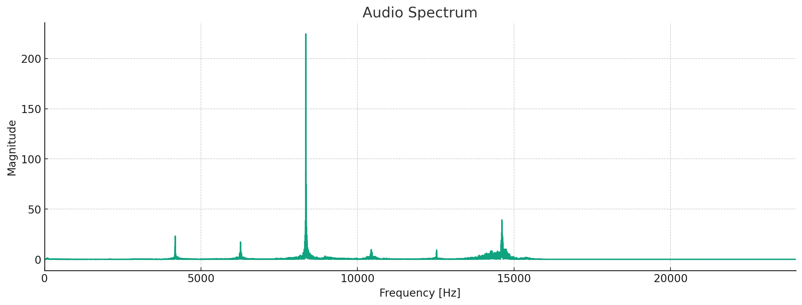 | 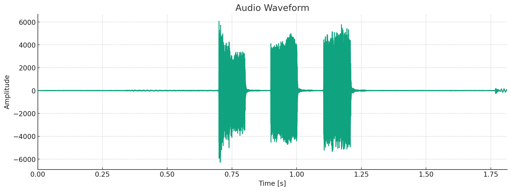 |
| <audio src="Img/Functional-Specifications/Sound_Soft_Alarm.wav" controls preload></audio> |  |  |

### 5.2.4 - Loud Alarm

The device will emit a loud alarm when a strong shock is detected. It will emit a 5 tones sound.

The sound duration is 7 seconds and the frequency is about 8350 Hz.

Following are the sound, the audio spectrum and the waveform of the loud alarm:

| Sound                                                                                                                                                                                 | Audio Spectrum                                                                | Waveform                                                             |
| ------------------------------------------------------------------------------------------------------------------------------------------------------------------------------------- | ----------------------------------------------------------------------------- | -------------------------------------------------------------------- |
| ) | 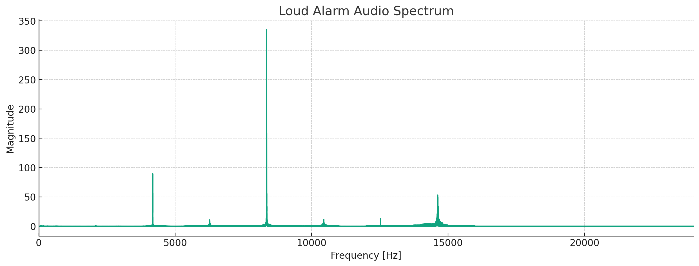 | 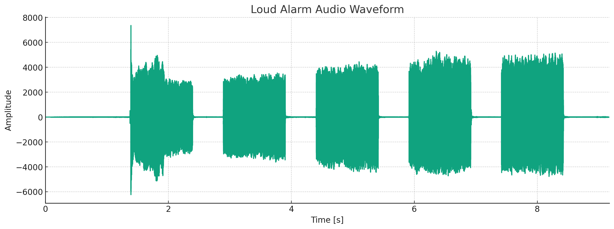 |

The Alarm will ring for 30 seconds, and then it will stop, if a command is not sent to the device to cut the alarm or if no security card is presented to the device, the alarm will ring again for 30 seconds unless no movement is detected.

### 5.2.5 - Confirmation Sound

The device will emit a sound to confirm the action. It will emit a short 2 tones sound.

The sound duration is 0.3 seconds and the frequency is about 4200 Hz and 8400 Hz.

Following are the sound, the audio spectrum and the waveform of the confirmation sound:

| Sound                                                                                                                                                                                 | Audio Spectrum                                                                | Waveform                                                             |
| ------------------------------------------------------------------------------------------------------------------------------------------------------------------------------------- | ----------------------------------------------------------------------------- | -------------------------------------------------------------------- |
| <audio controls="controls"><source type="audio/wav" src="Img/Functional-Specifications/Sound_Confirmation.wav"></source>
Your browser does not support the audio element.
</audio> | 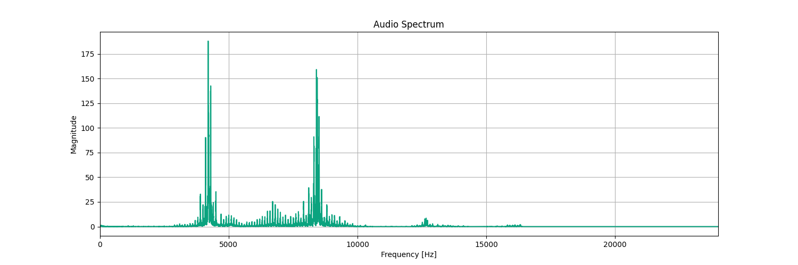 | 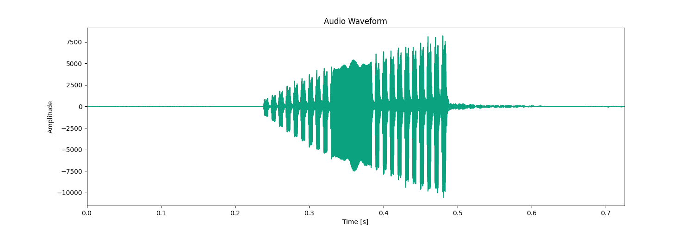 |

This sound will be emitted when the device have received a command from the mobile app or when the device have read a security card.

### 5.2.6 - Bluetooth Connection Sound

The device will emit a sound when the device is connected to the mobile app. It will emit a 5 tones sound.

The sound duration is 1.2 seconds and the frequency is about 4250 Hz and 8400 Hz.

Following are the sound, the audio spectrum and the waveform of the Bluetooth Connection sound:

| Sound                                                                                                                                                                                 | Audio Spectrum                                                                | Waveform                                                             |
| ------------------------------------------------------------------------------------------------------------------------------------------------------------------------------------- | ----------------------------------------------------------------------------- | -------------------------------------------------------------------- |
| <audio controls="controls"><source type="audio/wav" src="Img/Functional-Specifications/Sound_Bluetooth_Connection.wav"></source>
Your browser does not support the audio element.
</audio> | 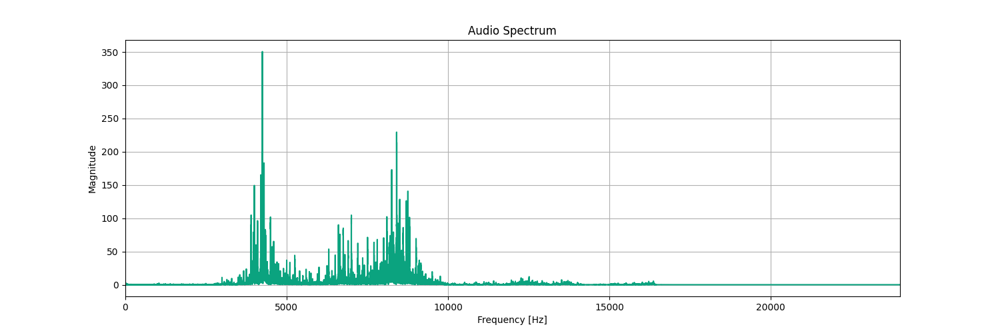 | 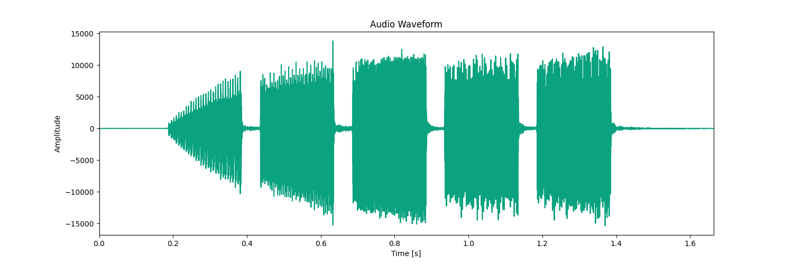 |

### 5.2.7 - Enter in Sleep Mode Sound

The device will emit a sound when the device enter in sleep mode. It will emit a 5 tones sound.

The sound duration is 1.2 seconds and the frequency is about 4300 Hz and 8400 Hz.

Following are the sound, the audio spectrum and the waveform of the Enter in Sleep Mode sound:

| Sound                                                                                                                                                                                 | Audio Spectrum                                                                | Waveform                                                             |
| ------------------------------------------------------------------------------------------------------------------------------------------------------------------------------------- | ----------------------------------------------------------------------------- | -------------------------------------------------------------------- |
| <audio controls="controls"><source type="audio/wav" src="Img/Functional-Specifications/Sound_Sleep_Mode.wav"></source>
Your browser does not support the audio element.
</audio> | 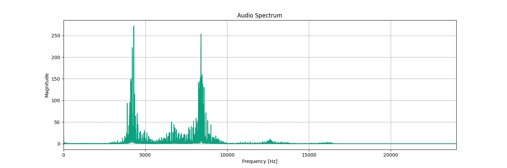 | 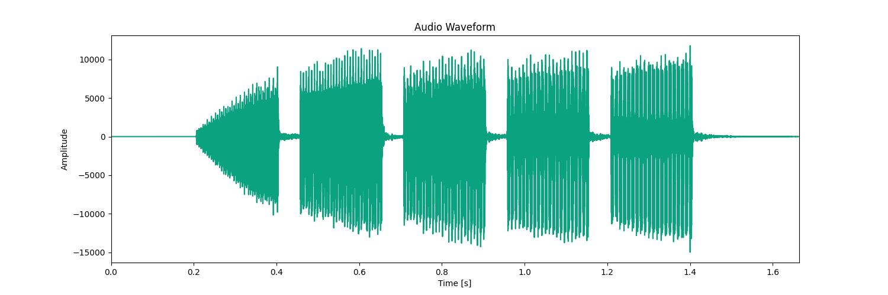 |

### 5.2.8 - Enter in Anti-Theft Mode Sound

The device will emit a sound when the device enter in anti-theft mode. It will emit a 5 tones sound.

The sound duration is 1.2 seconds and the frequency is about 4300 Hz and 8400 Hz.

Following are the sound, the audio spectrum and the waveform of the Enter in Anti-Theft Mode sound:

| Sound                                                                                                                                                                                 | Audio Spectrum                                                                | Waveform                                                             |
| ------------------------------------------------------------------------------------------------------------------------------------------------------------------------------------- | ----------------------------------------------------------------------------- | -------------------------------------------------------------------- |
| <audio controls="controls"><source type="audio/wav" src="Img/Functional-Specifications/Sound_Anti_Theft.wav"></source>
Your browser does not support the audio element.
</audio> | 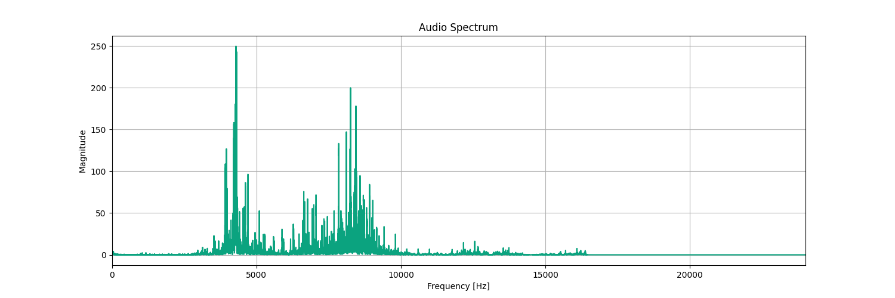 | 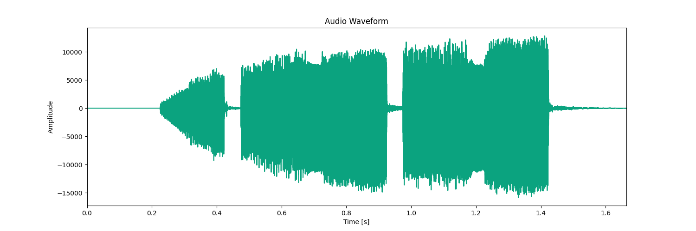 |

# 6. - Hardware and Libraries Used

## 6.1 - Hardware

### 6.1.1 - Microcontroller

The microcontroller is a Xiao BLE Sense nrf52840 from Seeed Studio. It is a small and powerful microcontroller with a built-in Bluetooth Low Energy 5.0 and a 6 Degrees of Freedom Inertial Measurement Unit (6-DoF IMU). It has 11 GPIOs that can be used as UART, SPI, I2C, etc.

Here are the main characteristics of the Xiao BLE Sense nrf52840:
- Dimensions : 2 x 2 x 0,5 cm
- Bluetooth Low Energy 5.0
- 6 Degrees of Freedom Inertial Measurement Unit (6-DoF IMU)
- 11 GPIOs (UART, SPI, I2C)
- Work Temperature: -40°C ~ +65°C
- [Product Specification](../Hardware/nRF52840_PS_v1.5.pdf)
- [Blueprints](../Hardware/Seeed-Studio-XIAO-nRF52840-Sense-v1.1.pdf)

### 6.1.2 - GNSS Module

The GNSS PA1010D is a small and powerful GPS module with an integrated antenna. It can be used to get the GPS coordinates of the device.

Here are the main characteristics of the GNSS PA1010D:
- Dimensions : 2,5 x 2,5 x 1 cm
- Integrated antenna
- UART & I2C
- Work Temperature: -40°C ~ +85°C
- [Datasheet](../Hardware/CD-PA1010D-Datasheet-v.02.pdf)

### 6.1.3 - GSM Module

The SIM800L is a small and powerful GSM/2G module with a SIM card holder. It can be used to send HTTP requests to the API to send the GPS coordinates and the battery level, and to send a notification when a shock is detected.

Here are the main characteristics of the GSM/2G SIM800L Module:
- Dimensions : 2,2 x 1,8 x 0,5 cm
- GPRS & HTTP, UART
- SIM Card holder
- With 1NCE SIM card
- Work Temperature : -40°C ~ +85°C
- [Hardware Design](../Hardware/SIM800L-SIMCom.pdf)

Although this sensor still uses the 2G network, which will no longer be in use by the end of 2025, we are still using it for the development phase, while this one can be easily replaced by a sensor that uses the 4G network.

### 6.1.4 - Electromagnet

The electromagnet is used to lock and unlock the security cable. It is powered by the device when the user wants to unlock the security cable.

Here are the main characteristics of the Electromagnet:
- Voltage : 12V, 500mA
- Dimensions : 2,7 x 1,6 x 1,3 cm
- Work Temperature : until 115°C

### 6.1.5 - Buzzer

The buzzer is used to emit audible signals upon detecting movement with the 6-DoF IMU. It emits moderate-level beeps for slight movements, and a loud alarm for significant ones.

Here are the main characteristics of the Piezoelectric buzzer:
- Voltage : 12V with control circuit oscillator
- Sound level : ~ 90-100 dB
- Work Temperature : -20°C ~ +70°C

### 6.1.6 - Battery

The battery is used to power the device. It is recharged via a USB-C port. For the moment the battery can last less than 3 days in normal use, but we are working on the energy management to increase the battery life.

Here are the main characteristics of the Lithium-Polymer battery:
- Dimensions : 5,1 x 3,5 x 0,6 cm
- Voltage : 3.7V, 1100mAh, 4.1Wh
- Work Temperature : -20°C ~ +60°C
- [Datasheet](../Hardware/Batterie_LP603449.pdf)

### 6.1.7 - NFC Antenna

The NFC antenna is used to replace the BLE if the user wants to unlock the device without using the mobile app or don't have much more battery. The user can unlock the device by approaching the NFC antenna with a NFC security card.

Here are the main characteristics of the NFC antenna:
- Dimensions : 5,5 x 4,5 x 0,017 cm
- Frequency : 13,56MHz
- Work Temperature : -30°C to +85°C

## 6.2 - Libraries

### 6.2.1 - NRF52_MBED_TimerInterrupt V1.4.1

This library is used to manage the timer interrupts of the microcontroller. It is used to manage the sleep mode and the alarm.

### 6.2.2 - ArduinoBLE V1.3.6

This library is used to manage the Bluetooth Low Energy communication between the device and the mobile app.

### 6.2.3 - Adafruit GPS Library V1.7.4

This library is used to manage the GPS module and to get the GPS coordinates of the device.

### 6.2.4 - Sim800L http connector V1.14.0

This library is used to manage the GSM module and to send HTTP requests to the API.

### 6.2.5 - Seeed Arduino LSM6DS3 V2.0.3

This library is used to manage the 6-DoF IMU of the microcontroller.

### 6.2.6 - OneWire V2.3.7

This library is used to manage the battery level of the device.