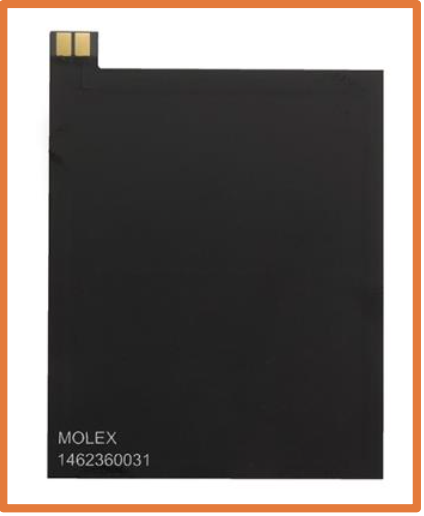

<div align="center">

# Technical Specification

---
**Title:** Sportshield Project - Team 3

**Author:** Abderrazaq MAKRAN

**Team:** Team 3

**Reviewer(s):** Salaheddine NAMIR

**Created on:** March 13<sup>th</sup>, 2024

**Last updated:**  March 25<sup>th</sup>, 2024

---

### Approvals

| Reviewer           | Role              | Approved | Date       |
| ------------------ | ----------------- | -------- | ---------- |
| Salaheddine NAMIR  | Quality Assurance |          | 26/03/2024 |
| Mouatassime SEIV   | Project Manager   |          | 26/03/2024 |
| Pierre GORIN       | Program Manager   |          | 26/03/2024 |
| Abderrazaq MAKRAN  | Technical Leader  |          | 26/03/2024 |  
| Michel RIFF        | Technical Writer  |          | 26/03/2024 |
| Guillaume DESPAUX  | Software Engineer |          | 26/03/2024 |


</div>

<br><details>
<summary><h3 id="toc"> Table of Contents <i>(Click to expand)</i></h3></summary>


</details>


---

# 1 - Overview

## 1.1 - Purpose

[*(Back to top)*](#toc)

### 1.1.1 - Goals
This project aims to enhance battery efficiency, prolong lifespan, and ensure secure device management. By optimizing energy usage, integrating NFC technology for convenient control, and improving alarm and security measures, the system will offer users a reliable and seamless experience with increased functionality and peace of mind.

### 1.1.2 - Objectives

The project objectives are as follow:

- Improve energy efficiency of the system.
- Management of a low battery situation.
- Increase the battery lifespan.
- NFC is an expected feature for the users, in order to activate/deactivate the anti-theft system & unlock the cable.
- Via their smartphone and SportShield app (redundant with Bluetooth function, to increase control options for users)
- Add the possibility to stop the alarm when it rings, even if the ringing cycle is not finished.
- Permit the alarm to ring while sending http notification to the server.
- Better management of interruptions
- Increase the security level to connect to the key features of the system

### 1.1.2 - Success Criteria

The project will be considered successful if the following criterias are met:

- Successful implementation and testing of the alarm system. 
- 
- Functioning mobile app with Bluetooth connectivity and GPS localization.
## 1.2 - Stakeholders

This project is for educational purposes and is intended for commercial use. The project team will be responsible for the development of the project and the client will be responsible for providing feedback and guidance throughout the development process.

### 1.2.1 - Project Team

| Name               | Role              | Github   |
| ------------------ | ----------------- | -------- |
| Salaheddine NAMIR  | Quality Assurance | [Salaheddine's Github](https://github.com/T3rryc)        |
| Mouatassime SEIV   | Project Manager   | [Mouatassime's Github](https://github.com/seiv007)       |
| Pierre GORIN       | Program Manager   | [Pierre's Github](https://github.com/Pierre2103)         |
| Abderrazaq MAKRAN  | Technical Leader  | [Abderrazaq's Github](https://github.com/Amakran2003)    |
| Michel RIFF        | Technical Writer  | [Michel's Github](https://github.com/MichelRiff)         |
| Guillaume DESPAUX  | Software Engineer | [Guillaume's Github](https://github.com/GuillaumeDespaux)|

### 1.2.2 - Client

| Name             | Role                 | Contact                                                         |
| ---------------- | -------------------- | --------------------------------------------------------------- |
| Coris Innovation | Client               | [Website](https://www.corisinnovation.com/coris-innovation)                             |
| Franck JEANNIN   | ALGOSUP's Co-Founder | [LinkedIn](https://www.linkedin.com/in/franck-jeannin/)         |
| Eric LARCHEVEQUE | ALGOSUP's Co-Founder | [LinkedIn](https://www.linkedin.com/in/ericlarch/)              |
| Natacha BOEZ     | ALGOSUP's Co-Founder | [LinkedIn](https://www.linkedin.com/in/natacha-boez-913a33167/) |

## 1.2 - Usage
[*(Back to top)*](#toc)

Develop an innovative anti-theft device for sports equipment and expand its application to other sectors such as camping gear, musical instruments, and locker rooms.

Provide a reliable security solution for individual users of medium to high-end skis and snowboards.


### 1.2.1 - Requirements
- [Arduino IDE](https://www.google.com/url?sa=t&rct=j&q=&esrc=s&source=web&cd=&cad=rja&uact=8&ved=2ahUKEwjm4NzL6_OEAxVTUaQEHfAYB8MQmhN6BAhVEAI&url=https%3A%2F%2Ffr.wikipedia.org%2Fwiki%2FArduino&usg=AOvVaw36wKonvDZOyb7wbdqDRmEy&opi=89978449) - Arduino is an Italian open-source hardware and software company, project, and user community that designs and manufactures single-board microcontrollers and microcontroller kits for building digital devices. 
- [VS Code](https://code.visualstudio.com/download) - Visual Studio Code is a free source-code editor made by Microsoft for Windows, Linux and macOS.
- [C/C++ for Visual Studio Code](https://marketplace.visualstudio.com/items?itemName=ms-vscode.cpptools) - C/C++ for Visual Studio Code is an extension for VS Code that provides IntelliSense, debugging, and code browsing support for C and C++ code.


The software is developed using the 23<sup>rd</sup> version of the C++ language.


### 1.2.2 - Running

## 1.4 - Scope

[*(Back to top)*](#toc)

### 1.4.1 - In Scope

The project will include the following features:

- Securing sports gear such as skis, snowboards, and related equipment from theft or unauthorized access.
- Sending instant notifications to users via the mobile app in case of unauthorized access or tampering with the protected equipment.
- Integrating GPS technology to enable users to track the location of their equipment in real-time, enhancing security and facilitating recovery efforts.
- Optimizing power consumption to ensure long-lasting battery life and uninterrupted protection of sports equipment.

### 1.4.2 - Out of Scope

The project will not include the following features:

- Protecting physical spaces or premises beyond the scope of securing sports equipment, such as home security or building access control.
- Implementing complex artificial intelligence or automation features beyond the basic functionalities required for equipment security and tracking.
- Offering security solutions for items unrelated to sports or outdoor activities, such as electronics, jewelry, or personal belongings.

---

# 2 - Overall Description

## 2.1 - Project Folder Structure

[*(Back to top)*](#toc)

The project will be organized in the following folder structure:

```bash
~ 2023-2024-project-4-sportshield-team-3                     # 🌳 Root folder
|----- docs                                                  # 📁 Documentation folder
|     |--- Hardware                                             # 📁
|     |    |-- Batterie_LP603449.pdf                               # 📃
|     |    |-- CD-PA1010D-Datasheet-v.02.pdf                       # 📃
|     |    |-- SIM800L-SIMCom.pdf                                  # 📃 
|     |    |-- Seeed-Studio-XIAO-nRF52840-Sense-v1.1.pdf           # 📃
|     |    └── nRF52840_PS_v1.5.pdf                                # 📃
|     ├── Management                                            # 📁 Management folder
|     |    |--- Team-Management                                    # 📁 Team management folder
|     |    |    |-- RACI.md                                           # 📖
|     |    |--- Weekly-Reports                                     # 📁 Weekly reports folder
|     |    |    |-- Cumulative.md                                     # 📖
|     |    |    |-- Template.md#                                      # 📖
|     |    |    |-- Weekly-Report-1.md#                               # 📖
|     |    |    |-- Weekly-Report-2.md#                               # 📖
|     |    |    |-- Weekly-Report-3.md#                               # 📖
|     |    |    |-- Weekly-Report-4.md#                               # 📖
|     |    |    |-- Weekly-Report-5.md#                               # 📖
|     |    |    └── Weekly-Report-6.md#                               # 📖
|     |    |-- Project-Charter.md                                  # 📖 Project charter file
|     |    └── Risk-Management-Plan.md                             # 📖 Risk management plan file
|     └── Specifications                                        # 📁
|          |-- img                                                 # 📁 Images folder
|          |  |-- Functional-Specifications
|          |  |    |-- 1.png 
|          |  |    └── [etc...] 
|          |  |-- Technical-Specifications 
|          |  |    |-- 1.png 
|          |  |    └── [etc...] 
|          |  └── Test-Plan
|          |       |-- 1.png 
|          |       └── [etc...] 
|          |
|          |-- Functional-Specifications.md                     # 📖
|          |-- Technical-Specifications.md                      # 📖
|          └── Test-Plan.md                                     # 📖
|----- src                                                   # 📁
|        |-- struct.h                                           # 📄
|        └── SS_05-03_anglais-batterycontrol.ino                # 📝
|-- .gitignore                                               # 📖
|-- LICENSE.MD                                               # 📖
└── README.md                                                # 📖

```

**Legend:**
| 🌳          | 📁       | 📖        | 📃      | 📄           | 📝            | 🖼️     |
| ----------- | ------- | --------- | ------- | ------------ | ------------- | ------ |
| Root folder | Folders | Documents | PDF Files | Header Files | Arduino File | Images |
## 2.2 - Conventions

[*(Back to top)*](#toc)

### 2.2.1 - Naming Conventions

Naming conventions[^16] are important to keep a clear navigation through the directories, our project will follow the following naming conventions:

#### 2.2.1.1 Folders

- Folder will be written in `Train-Case` and in English.

#### 2.2.1.2 Files

- File related to documentation or management will be written in `Train-Case` and in English.
- Example: `Documentation-File.md`
- File related to source code will be written in `snake_case` and in English.
- Example: `source_code_file.c`

#### 2.2.1.3 Variables

- Variable will be written in `snake_case` and in English.
- Example: `variable_name`.

#### 2.2.1.4 Constants

- Constant names will be written in `UPPER_SNAKE_CASE` and in English.
- Example: `CONSTANT_NAME`.

#### 2.2.1.5 Functions

- Function names will be written in `camelCase` and in English.
- Example: `functionName`.

#### 2.2.1.6 Tests

- Test functions will be written in `functionName` followed by `TEST`.
- Example: `functionNameTEST`.

### 2.2.2 - Formatting Conventions

Formatting conventions are important to keep a clear, concise and readable code, our project will follow the following formatting conventions:

#### 2.2.2.1 - Indentation

- Indentation will be done with 4 spaces.
- Indentation will be done with spaces, not tabs.

#### 2.2.2.2 - Line Length

- Lines will be limited to 100 characters.
- Lines will be limited to 150 characters for comments.

#### 2.2.2.3 - Line Breaks

- Break the line two spaces before a function call.
- Break the line two spaces before a function declaration.
- Break the line one space between each variables declaration.
- Do not break the line between a function name and its parameters.
- Do not break the line in an if or a switch statement.
- Do not break the line in a for or a while loop.

#### 2.2.2.4 - Comments

- Comments will be written in English.
- Comments will be written on the line above the code they refer to.
- Comments will be written in `Sentence case`.

# 3 System Architecture

[*(Back to top)*](#toc)

### 3.1 - Hardware

| Specification    | Lenovo ThinkBook 14  | Apple MacBook Air M1 2020 |
| ---------------- | -------------------- | ------------------------- |
| Processor        | Intel Core i7-1065G7 | Apple Silicon M1          |
| RAM[^15]         | 16 GB                |  8 GB                     |
| Operating System | Windows 11 Pro       | macOS Sonoma              |


|Name|Size|Specification|Role|Image|
|--------------|-------|---------|------------|--------|
|Xiao BLE Sense nrf52840  |2 x 2 x 0,5 cm         |- BLE 5.0 & 6 DoF IMU - 11 GPIO (UART, SPI, I2C)             | The Xiao BLE Sense nrf52840 serves as a compact yet powerful development board integrating Bluetooth 5.0 connectivity, motion sensing capabilities, and GPIO pins for versatile IoT prototyping and sensor-based applications.                    |                    |
|GNSS PA1010D             |2,5 x 2,5 x 1 cm       |- Integrated antenna - UART & I2C                            | The GNSS PA1010D serves as a high-performance Global Navigation Satellite System (GNSS) module, providing accurate positioning and timing information for applications ranging from asset tracking and navigation to precision agriculture and geolocation services. |                    |
| GSM/2G SIM800L Module   | 2,2 x 1,8 x 0,5 cm    | - GPRS & HTTP, UART - SIM Card holde -> With 1NCE SIM card  | The GSM/2G SIM800L Module facilitates cellular connectivity, enabling data transmission, SMS communication, and voice calls, making it suitable for IoT projects, remote monitoring, and communication applications in areas with GSM network coverage.    |  |
| Electromagnet           | 2,7 x 1,6 x 1,3 cm    | 12V, 500mA                                                  | The electromagnet is utilized to secure or release the Sportshield device through magnetic locking mechanisms for enhanced security and convenience.                    |  |
| Piezoelectric buzzer    | unknown               | - 12V, avec oscillator control circuit - ~ 90-100 dB        | The piezoelectric buzzer emits audible alerts or tones by converting electrical energy into mechanical vibrations.                  |                |
| Lithium-Polymer battery | 5,1 x 3,5 x 0,6 cm    | 3.7V, 1100mAh, 4.1Wh                                        | The Lithium-Polymer battery serves as a rechargeable power source, providing high energy density and lightweight characteristics for powering the Sportshield device.                    |              |
| NFC antenna             | 5,5 x 4,5 x 0,017 cm  | 13,56MHz frequency                                          |  The NFC antenna facilitates Near Field Communication (NFC) capabilities, enabling contactless data exchange and communication between device over short distances.|                      |


### 3.2 - Software 
- Programming Language: Arduino (C/C++) 
- IDE: Arduino IDE
- Main Software Files:
  - `original.ino`: Contains original code or primary logic for SportShield.
  - `software_team3.ino`: Contains modified code by our dev.
  - `batteryState.ino`: Manages battery state and consumption.
  - `bluetooth.ino`: Handles Bluetooth connectivity for the mobile app.
  - `gps.ino`: Implements GPS functionality for device localization.
  - `imu.ino`: Manages the Inertial Measurement Unit (IMU) for movement detection.
  - `nfc.ino`: Controls NFC functionality for device management.
  - `sim.ino`: Handles SIM card communication for GPRS connectivity.
  - `sounds.ino`: Implements sound generation for alarm and notifications.
  - `struct.h`: Contains data structures used across the software components.

#### 3.2.1 - `original.ino`

The `original.ino` file serves as the main sketch provided by Coris Innovation for the SportShield project. It encompasses the central logic and functionality of the SportShield device, orchestrating the behavior of the hardware components, sensors, and communication modules to achieve the project's objectives.

#### 3.2.2 - `batteryState.ino`

>Purpose:

The `batteryState.ino` file is responsible for managing the battery state and consumption within the SportShield device. It ensures efficient utilization of the battery power, monitors the battery voltage levels, and implements strategies to handle low battery situations effectively.

>Functionality:

This Arduino sketch implements the following functionalities related to battery management:

Monitoring Battery Voltage: The file contains functions to read the voltage level of the battery periodically using analog-to-digital conversion techniques. It interprets the raw voltage readings to determine the current state of charge and estimates the remaining battery capacity.

Low Battery Detection: It includes algorithms to detect low battery conditions based on predefined voltage thresholds. When the battery voltage drops below a certain threshold, appropriate actions are triggered to notify the user, conserve power, or switch to alternative power sources.

Power Optimization: The sketch implements strategies to optimize power consumption and extend battery life. This may involve adjusting the operating modes of various components, reducing the frequency of sensor readings or wireless transmissions, and implementing sleep modes to minimize idle power consumption.

>Inputs:

Analog Voltage Readings: Raw voltage readings obtained from the battery voltage monitoring circuitry.

>Outputs:

Battery Status Updates: Notifications or status messages indicating the current battery state, such as voltage level, remaining capacity, or estimated runtime.

>Dependencies:

The batteryState.ino file may depend on external libraries or utility functions for performing analog-to-digital conversions, voltage threshold comparisons, and power management routines.

>Usage:
- Include the batteryState.ino file as part of the SportShield project in the Arduino IDE.
- Integrate function calls from this file into the main control logic (original.ino) to ensure continuous monitoring of the battery state.
- Configure voltage threshold values and battery management parameters according to the specifications provided by Coris Innovation.
- Test the battery management functionality under various load conditions, battery states, and environmental factors to verify its reliability and effectiveness.

#### 3.2.2 - `bluetooth.ino`

>Purpose:

The purpose of the `bluetooth.ino` file is to handle Bluetooth connectivity for the SportShield device, allowing communication with a mobile app for remote control and data exchange.

>Functionality:

This file implements Bluetooth functionality using the Bluetooth module integrated into the SportShield device. It manages the establishment of Bluetooth connections, data transmission/reception, and handling of Bluetooth events.

>Inputs:

- Bluetooth commands or data received from the mobile app.
- Configuration parameters for Bluetooth initialization (e.g., device name, pairing mode).

>Outputs:

- Bluetooth data packets sent to the mobile app.
- Bluetooth connection status updates or events.

>Dependencies:

- This file depends on the underlying Bluetooth library provided by the microcontroller platform (e.g., Arduino Bluetooth library).
It may interact with other system components such as sensors, actuators, or the main control logic.

>Usage:

- Include the bluetooth.ino file in the `software_team3.ino` project file.
- Initialize the Bluetooth module and configure its parameters (e.g., device name, pairing mode) using appropriate function calls.
- Set up event handlers or callback functions to handle Bluetooth events such as connection/disconnection, data reception, or errors.
- Implement the main logic for Bluetooth communication, including sending/receiving data to/from the mobile app and responding to user commands.
- Test the Bluetooth functionality thoroughly to ensure proper communication and reliability.

#### 3.2.4 - `gps.ino`

>Purpose:

The purpose of the gps.ino file is to implement GPS functionality for the SportShield device, enabling accurate positioning and location tracking.

>Functionality:

This file interfaces with a GPS module integrated into the SportShield device to retrieve GPS data such as latitude, longitude, altitude, and satellite information. It processes this data to provide real-time location information and enables tracking features for the device.

>Inputs:

- GPS data received from the GPS module, including latitude, longitude, altitude, and satellite information.
- Configuration parameters for GPS initialization and operation (e.g., update rate, data format).

>Outputs:

- Processed GPS data, including current location coordinates (latitude, longitude), altitude, and satellite information.
-Location updates or events triggered based on GPS data changes or thresholds.

>Dependencies:

This file depends on the underlying GPS library or module integrated into the SportShield hardware. It may interact with other system components such as the main control logic, Bluetooth module for transmitting location data, or storage module for logging location history.

>Usage:

- Include the `gps.ino` file in the `software_team3.ino` project file.
- Initialize the GPS module and configure its parameters (e.g., update rate, data format) using appropriate function calls.
- Set up event handlers or callback functions to process GPS data and trigger location updates or events.
- Implement logic for processing GPS data, including parsing raw GPS data, calculating location coordinates, and updating location information.
- Integrate GPS functionality with other system components such as Bluetooth for transmitting location data to a mobile app or storage module for logging location history.
- Test the GPS functionality thoroughly to ensure accurate positioning, reliable location tracking, and proper integration with the overall system.

#### 3.2.5 - `imu.ino`

>Purpose:

The purpose of the `imu.ino` file is to manage the Inertial Measurement Unit (IMU) integrated into the SportShield device, which provides motion sensing capabilities.

>Functionality:

This file interacts with the IMU sensor to collect data related to the device's orientation, acceleration, and angular velocity. It processes this data to detect motion events, such as tilting, shaking, or sudden movements, and triggers corresponding actions or alarms.

>Inputs:
- Raw sensor data from the IMU sensor, including accelerometer, gyroscope, and magnetometer readings.
- Configuration parameters for IMU initialization and operation (e.g., sensor range, sampling rate).

>Outputs:

- Processed motion data, including orientation, acceleration, and angular velocity information.
- Motion events or alarms triggered based on predefined thresholds or patterns detected in the sensor data.

>Dependencies:

This file depends on the underlying IMU library or sensor driver integrated into the SportShield hardware. It may interact with other system components such as the main control logic, Bluetooth module for transmitting motion data, or alarm module for triggering alerts based on motion events.

>Usage:

- Include the `imu.ino` file in the `software_team3.ino` project file.
- Initialize the IMU sensor and configure its parameters (e.g., sensor range, sampling rate) using appropriate function calls.
- Set up event handlers or callback functions to process IMU data and detect motion events.
- Implement logic for processing IMU data, including filtering, fusion, and interpretation of sensor readings to determine device orientation, acceleration, and angular velocity.
- Integrate IMU functionality with other system components such as Bluetooth for transmitting motion data to a mobile app or alarm module for triggering alerts based on detected motion events.
- Test the IMU functionality thoroughly to ensure accurate motion sensing, reliable event detection, and proper integration with the overall system.

#### 3.2.6 - `nfc.ino`

>Purpose:

The purpose of the `nfc.ino` file is to manage Near Field Communication (NFC) functionality for the SportShield device, enabling contactless data exchange and communication with NFC-enabled devices or tags.

>Functionality:

This file interacts with the NFC module integrated into the SportShield hardware to perform various NFC-related tasks, including reading/writing NFC tags, detecting NFC devices, and exchanging data with NFC-enabled smartphones or other devices.

>Inputs:

- NFC data received from external NFC devices or tags.
- Configuration parameters for NFC initialization and operation (e.g., communication mode, tag detection settings).

>Outputs:

- Data transmitted to or received from external NFC devices or tags.
- Status updates or events related to NFC communication (e.g., tag detection, data exchange).

>Dependencies:

This file depends on the underlying NFC library or driver provided by the microcontroller platform (e.g., Arduino NFC library).
It may interact with other system components such as the main control logic, Bluetooth module for transmitting NFC data to a mobile app, or storage module for saving NFC tag data.

>Usage:

- Include the `nfc.ino` file in the `software_team3.ino` project file.
- Initialize the NFC module and configure its parameters (e.g., communication mode, tag detection settings) using appropriate function calls.
- Set up event handlers or callback functions to handle NFC events such as tag detection, data exchange, or errors.
- Implement logic for reading/writing NFC tags, detecting NFC devices, and exchanging data with external NFC-enabled devices.
- Integrate NFC functionality with other system components such as Bluetooth for transmitting NFC data to a mobile app or storage module for saving NFC tag data.
- Test the NFC functionality thoroughly to ensure reliable communication, accurate tag detection, and proper integration with the overall system.

#### 3.2.7 - `sim.ino`

>Purpose:

The purpose of the sim.ino file is to manage communication with the Subscriber Identity Module (SIM) card used for Global System for Mobile Communications (GSM) connectivity in the SportShield device. It handles tasks such as sending and receiving data over the cellular network.

>Functionality:

This file interacts with the SIM800L GSM module integrated into the SportShield hardware to establish and maintain a connection with the cellular network. It facilitates tasks such as sending SMS messages, making voice calls, and establishing data connections (GPRS) for internet access.

>Inputs:

- Commands or data received from the main control logic or external sources, such as user inputs or sensor readings.
- Configuration parameters for SIM card initialization and communication settings (e.g., APN, authentication credentials).

>Outputs:

- Data transmitted to or received from the cellular network via the SIM card.
- Status updates or events related to SIM card communication, such as connection status, signal strength, or network registration.

>Dependencies:

This file depends on the underlying library or driver provided by the microcontroller platform for interfacing with the SIM800L GSM module.
It may interact with other system components such as the main control logic, sensors, actuators, or communication protocols (e.g., MQTT) for transmitting data over the cellular network.

>Usage:

- Include the `sim.ino` file in the software_team3.ino project file.
- Initialize the SIM card module and configure its parameters (e.g., APN, authentication credentials) using appropriate function calls.
- Implement logic for sending SMS messages, making voice calls, and establishing data connections (GPRS) as needed for the SportShield application.
- Set up event handlers or callback functions to handle SIM card events such as network registration, connection status changes, or errors.
- Integrate SIM card functionality with other system components such as sensor data acquisition, alarm triggers, or user notifications.
- Test the SIM card functionality thoroughly to ensure reliable communication, proper network registration, and robust error handling.

#### 3.2.8 - `sounds.ino`

>Purpose:

The purpose of the `sounds.ino` file is to generate sound signals, including alarms, notifications, and feedback tones, using the audio capabilities of the SportShield device. It manages the generation of sound patterns and volume control for auditory alerts.

>Functionality:

This file implements functions to control the piezoelectric buzzer or speaker integrated into the SportShield hardware. It generates sound signals of varying frequencies, durations, and amplitudes to convey different types of information to the user.

>Inputs:

- Commands or signals received from the main control logic or other system components triggering sound events, such as alarm conditions, user interactions, or system errors.
- Parameters specifying the characteristics of sound signals to be generated, such as frequency, duration, and volume levels.

>Outputs:

- Sound signals produced by the piezoelectric buzzer or speaker, including alarms, notifications, and feedback tones.
- Status updates or events related to sound generation, such as completion of sound playback, errors in sound production, or changes in volume levels.

>Dependencies:

This file may depend on the underlying library or driver provided by the microcontroller platform for controlling audio output peripherals.
It may interact with other system components such as the main control logic, sensors, user interface elements, or communication modules to synchronize sound events with system operation.

>Usage:

- Include the `sounds.ino` file in the `software_team3.ino` project file.
- Initialize the audio output peripheral (e.g., piezoelectric buzzer or speaker) and configure its parameters (e.g., volume levels) using appropriate function calls.
- Implement functions to generate specific sound patterns for different events or conditions, such as alarm activation, user interface feedback, or error alerts.
- Define sound profiles or sequences for complex auditory notifications or alarms, incorporating variations in frequency, duration, and intensity as needed.
- Integrate sound generation logic with other system components to provide informative and intuitive feedback to the user during device operation.
- Test the sound generation functionality thoroughly to ensure accurate reproduction of sound signals, appropriate volume levels, and reliable operation under various conditions.

#### 3.2.9 - `struct.h`

>Purpose:

The purpose of the `struct.h` file is to define data structures and types used throughout the SportShield software, providing a consistent and organized way to represent and manipulate complex data entities.

>Functionality:

This header file contains declarations of struct types, enums, and typedefs representing various entities and concepts relevant to the SportShield system. It defines the structure of data exchanged between system components and facilitates communication, data storage, and processing.

>Inputs:

- Data inputs from sensors, user inputs, communication modules, or other system components that need to be organized and processed.
- Configuration parameters, constants, or settings used to define the behavior or characteristics of system entities.

>Outputs:

- Structured data types representing different aspects of the SportShield system, including sensor readings, device configurations, user commands, and system states.
- Enumerated types defining sets of symbolic constants representing discrete values or options for specific system parameters or attributes.

>Dependencies:

This file may depend on standard or platform-specific header files for data types and macros used in struct definitions (e.g., stdint.h, Arduino.h).
It may interact with other header files or source files within the SportShield software project to exchange structured data or share common definitions.

>Usage:

- Include the struct.h header file in all source files requiring access to the defined data structures or types.
- Define struct types, enums, and typedefs necessary to represent the data entities and concepts relevant to the SportShield system.
- Use the defined data structures to organize and manipulate data inputs, outputs, and intermediate values within the software components.
- Ensure consistency and coherence in the naming, organization, and usage of data structures to maintain clarity and facilitate comprehension and maintenance of the software codebase.
- Document the purpose, structure, and usage guidelines for each defined data structure or type to aid developers in understanding and using them effectively.
- Test the data structures and their associated functionality rigorously to verify correct behavior, adherence to specifications, and compatibility with other system components.

# 5 - End Matter

## 4.1 - Contributors
[*(Back to top)*](#toc)

|                                                                                                        Photos                                                                                                        |         Name          |                                                                     GitHub                                                                     |                                                                               LinkedIn                                                                                |
| :------------------------------------------------------------------------------------------------------------------------------------------------------------------------------------------------------------------: | :-------------------: | :--------------------------------------------------------------------------------------------------------------------------------------------: | :-------------------------------------------------------------------------------------------------------------------------------------------------------------------: |
|  | **Mouatassime SEIV**  |         [](https://github.com/seiv007)          |  [](https://www.linkedin.com/in/moutassime-seiv-9542171a9/)   |
|                                                                                                                         |   **Pierre GORIN**    |       [](https://github.com/Pierre2103)       |      [](https://www.linkedin.com/in/pierre-gorin-61a784221/)      |
|                                                                                                                        | **Abderrazaq MAKRAN** |      [](https://github.com/Amakran2003)      |      [](https://www.linkedin.com/in/abderrazaq-makran/)      |
|                                                                                                                        |    **Michel RIFF**    |       [](https://github.com/MichelRiff)       |       [](https://www.linkedin.com/in/michel-riff-693007293/)       |
|                                                                                                                        | **Guillaume DESPAUX** | [](https://github.com/GuillaumeDespaux) | [](https://www.linkedin.com/in/guillaume-despaux-084b10206/) |
|                                                                                                                         | **Salaheddine NAMIR** |           [](https://github.com/T3rryc)           | [](https://www.linkedin.com/in/salaheddine-namir-3402471b8/) |


## 4.2 - Related Documents

[*(Back to top)*](#toc)

|                        Document                         |                              Description                              |
| :-----------------------------------------------------: | :-------------------------------------------------------------------: |
| [Functional Specification](Functional-Specifications.md) | This document describes the functional specifications of the project. |
|                [Test Plan](Test-Plan.md)                |         This document describes the test plan of the project.         |
|                 [Readme](../../readme.md)                  |                 This document describes the project.                  |

## 4.2 - License

[*(Back to top)*](#toc)

This project is licensed under the MIT License - see the [LICENSE](/Users/abderrazaqmakran/Documents/2023-2024-project-4-sportshield-team-3/LICENSE.MD) file for details.

## 4.4 - References

[*(Back to top)*](#toc)

In this section, you will find all the tools and references used to create this document.

### 4.4.1 - Tools
- [Mermaid Live Editor](https://mermaid-js.github.io/mermaid-live-editor/)
- [Shield.io](https://shields.io/)

### 4.4.2 - References
- [Markdown Guide](https://www.markdownguide.org/cheat-sheet/)
- [Practical Guide to Writing Technical Specs](https://stackoverflow.blog/2020/04/06/a-practical-guide-to-writing-technical-specs/)

## 4.5 - Glossary

[*(Back to top)*](#toc)

<!-- |             Term              |                                                                                                                     Definition                                                                                                                      |                                                                                    What it means in this project                                                                                    |                              Additional Content                               |
| :---------------------------: | :-------------------------------------------------------------------------------------------------------------------------------------------------------------------------------------------------------------------------------------------------: | :-------------------------------------------------------------------------------------------------------------------------------------------------------------------------------------------------: | :---------------------------------------------------------------------------: |
|       **Processor[^1]**       |                                                                   A processor is the logic circuitry that responds to and processes the basic instructions that drive a computer.                                                                   |                                                             The processor is the virtual processor that will execute the assembly code.                                                             |      [Wikipedia](https://en.wikipedia.org/wiki/Central_processing_unit)       |
|      **Interpreter[^2]**      |       In computer science, an interpreter is a computer program that directly executes instructions written in a programming or scripting language, without requiring them previously to have been compiled into a machine language program.        |                                                            The interpreter is the virtual processor that will execute the assembly code.                                                            |      [Wikipedia](https://en.wikipedia.org/wiki/Interpreter_(computing))       |
|   **Assembly Language[^3]**   | An assembly language is a low-level programming language for a computer, or other programmable device, in which there is a very strong (generally one-to-one) correspondence between the language and the architecture's machine code instructions. |                                                      The assembly language is the language that will be interpreted by the virtual processor.                                                       |         [Wikipedia](https://en.wikipedia.org/wiki/Assembly_language)          |
|           **C[^4]**           |                                        C is a general-purpose, procedural computer programming language supporting structured programming, lexical variable scope, and recursion, with a static type system.                                        |                                                                       C is the language used to write the virtual processor.                                                                        |      [Wikipedia](https://en.wikipedia.org/wiki/C_(programming_language))      |
|  **Low-Level Language[^5]**   |                                                  A low-level programming language is a programming language that provides little or no abstraction from a computer's instruction set architecture.                                                  |                                                                           The assembly language is a low-level language.                                                                            |   [Wikipedia](https://en.wikipedia.org/wiki/Low-level_programming_language)   |
|       **Emulation[^6]**       |                                                   In computing, emulation refers to the ability of a computer program in an electronic device to emulate (or imitate) another program or device.                                                    |                                                                           The virtual processor will emulate a processor.                                                                           |              [Wikipedia](https://en.wikipedia.org/wiki/Emulator)              |
|      **Instruction[^7]**      |                                                                                   An instruction is an order given to a computer processor by a computer program.                                                                                   |                                                                         The assembly language is composed of instructions.                                                                          |   [Wikipedia](https://en.wikipedia.org/wiki/Instruction_(computer_science))   |
|   **Operating System[^8]**    |                                                   An operating system is system software that manages computer hardware, software resources, and provides common services for computer programs.                                                    |                                                              The operating system is the software that will run the virtual processor.                                                              |          [Wikipedia](https://en.wikipedia.org/wiki/Operating_system)          |
|  **Visual Studio Code[^9]**   |                                                                           Visual Studio Code is a free source-code editor made by Microsoft for Windows, Linux and macOS.                                                                           |                                                               Visual Studio Code is the IDE[^10] used to write the virtual processor.                                                               |         [Wikipedia](https://en.wikipedia.org/wiki/Visual_Studio_Code)         |
|         **IDE[^10]**          |                                           An integrated development environment (IDE) is a software application that provides comprehensive facilities to computer programmers for software development.                                            |                                                                 Visual Studio Code is the IDE used to write the virtual processor.                                                                  | [Wikipedia](https://en.wikipedia.org/wiki/Integrated_development_environment) |
|         **GCC[^11]**          |                                                  GCC, formerly an acronym for GNU Compiler Collection, is a compiler system produced by the GNU Project supporting various programming languages.                                                   |                                                                     GCC is the compiler used to compile the virtual processor.                                                                      |      [Wikipedia](https://en.wikipedia.org/wiki/GNU_Compiler_Collection)       |
|       **Compiler[^12]**       |                                        A compiler is a computer program that translates computer code written in one programming language (the source language) into another language (the target language).                                        |                                                                     GCC is the compiler used to compile the virtual processor.                                                                      |              [Wikipedia](https://en.wikipedia.org/wiki/Compiler)              |
| **Performance Analysis[^13]** |                                   Performance analysis is the process of assessing the performance of a computer, comparing the performance of one or more systems, or evaluating the performance of a component.                                   |                                                     Performance analysis is the process of assessing the performance of the virtual processor.                                                      |  [Wikipedia](https://en.wikipedia.org/wiki/Profiling_(computer_programming))  |
|  **Memory Management[^14]**   |                               Memory management is the process of controlling and coordinating computer memory, assigning portions called blocks to various running programs to optimize overall system performance.                                |       Memory management is the process of controlling and coordinating computer memory, assigning portions called blocks to various running programs to optimize overall system performance.        |         [Wikipedia](https://en.wikipedia.org/wiki/Memory_management)          |
|         **RAM[^15]**          |                                              Random-access memory (RAM) is a form of computer memory that can be read and changed in any order, typically used to store working data and machine code.                                              |                                                                          RAM is the memory used by the virtual processor.                                                                           |        [Wikipedia](https://en.wikipedia.org/wiki/Random-access_memory)        |
|  **Naming Convention[^16]**   |                         A naming convention is a set of rules for choosing the character sequence to be used for identifiers which denote variables, types, functions, and other entities in source code and documentation.                         | A naming convention is a set of rules for choosing the character sequence to be used for identifiers which denote variables, types, functions, and other entities in source code and documentation. |  [Wikipedia](https://en.wikipedia.org/wiki/Naming_convention_(programming))   |
|       **Register[^17]**       |                                                      In computer architecture, a processor register is a quickly accessible location available to a computer's central processing unit (CPU).                                                       |                                                                     Registers are used by the virtual processor to store data.                                                                      |         [Wikipedia](https://en.wikipedia.org/wiki/Processor_register)         |
|         **Jump[^18]**         |                                                           In computer science, a jump statement is a statement that unconditionally transfers program control to a designated statement.                                                            |                                                         Jump statements are used by the virtual processor to change the flow of execution.                                                          |     [Wikipedia](https://en.wikipedia.org/wiki/Branch_(computer_science))      |
|       **Parsing[^19]**        |                  Parsing, syntax analysis, or syntactic analysis is the process of analyzing a string of symbols, either in natural language, computer languages or data structures, conforming to the rules of a formal grammar.                   |                                                                   Parsing is the process of analyzing the assembly language code.                                                                   |              [Wikipedia](https://en.wikipedia.org/wiki/Parsing)               |
|       **Operand[^20]**        |                                                    In mathematics and computer programming, an operand is the object of a mathematical operation, a quantity on which an operation is performed.                                                    |                                                            Operands are used by the virtual processor to perform arithmetic operations.                                                             |              [Wikipedia](https://en.wikipedia.org/wiki/Operand)               | -->

## 4.6 - Footnotes

[*(Back to top)*](#toc)

[^1]:  []()
[^2]:  []()
[^3]:  []()
[^4]:  []()
[^5]:  []()
[^6]:  []()
[^7]:  []()
[^8]:  []()
[^9]:  []()
[^10]: []()
[^11]: []()
[^12]: []()
[^13]: []()
[^14]: []()
[^15]: []()
[^16]: []()
[^17]: []()
[^18]: []()
[^19]: []()
[^20]: []()
