# User Manual for SportShield

## 0. Index
- [User Manual for SportShield](#user-manual-for-sportshield)
  - [0. Index](#0-index)
  - [1. Introduction](#1-introduction)
  - [2. Product Overview](#2-product-overview)
    - [2.1 Product Information](#21-product-information)
    - [2.2 Intended Use](#22-intended-use)
      - [2.2.1 Alarm system](#221-alarm-system)
      - [2.2.2 USB-C charging port](#222-usb-c-charging-port)
      - [2.2.3 Near Field Communication (NFC)](#223-near-field-communication-nfc)
      - [2.2.4 Physical security features](#224-physical-security-features)
  - [3. User Interface Description](#3-user-interface-description)
    - [3.1 Connection: Instructions for connecting the device to user's equipement](#31-connection-instructions-for-connecting-the-device-to-users-equipement)
    - [3.2 Security card Setup: Step-by-step for the device for the security card setup and pairing](#32-security-card-setup-step-by-step-for-the-device-for-the-security-card-setup-and-pairing)
  - [4. Safety Warning](#4-safety-warning)
  - [5. Operation Guide](#5-operation-guide)
    - [5.1 Enabling or disabling the Anti-Theft Protection and unlock the device](#51-enabling-or-disabling-the-anti-theft-protection-and-unlock-the-device)
      - [5.1.1 Activate and deactivate the Anti-Theft Protection using the Mobile App](#511-activate-and-deactivate-the-anti-theft-protection-using-the-mobile-app)
      - [5.1.2 Activate and deactivate the Anti-Theft Protection and unlock the device by using the Security Card](#512-activate-and-deactivate-the-anti-theft-protection-and-unlock-the-device-by-using-the-security-card)
    - [5.2 Location and battery Tracking: Viewing device location and battery via app](#52-location-and-battery-tracking-viewing-device-location-and-battery-via-app)
    - [5.3 Cut the Alarm off](#53-cut-the-alarm-off)
      - [5.3.1 Cut the Alarm with the Mobile App](#531-cut-the-alarm-with-the-mobile-app)
      - [5.3.2 Cut the Alarm with the Security Card](#532-cut-the-alarm-with-the-security-card)
    - [5.4 Sleep Mode Activation: Instructions for conserving battery life](#54-sleep-mode-activation-instructions-for-conserving-battery-life)
  - [6. TroubleShooting](#6-troubleshooting)
  - [7. Glossary](#7-glossary)
  - [8. Contact Details](#8-contact-details)

             

- - -

## 1. Introduction
This manual provide instructions and detailed procedures for installing, operating, maintaining, and troubleshooting about this anti-theft device SportShield from Coris Innovation. Read and undertsand every warnings and precautions before using this product.
  

- - -

## 2. Product Overview
### 2.1 Product Information
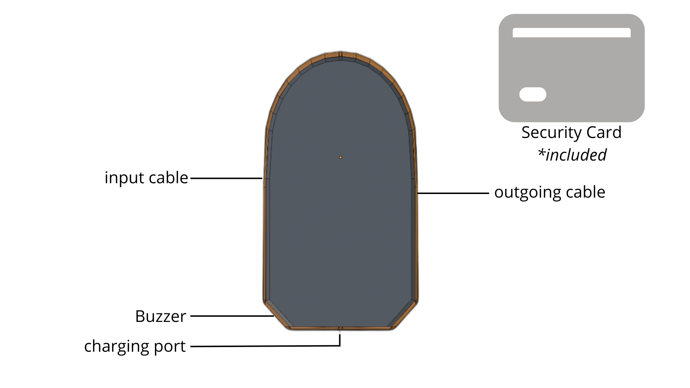
>- Charging port
>- Locker
>   - outgoing cable
>   - input cable
>- Buzzer
>- NFC (*under the device*)
  

### 2.2 Intended Use
The sportShield device is able to work in any environment to protect your equipment in public area. It should be able to work equally well in cold and hot environments.
It can be in a sleep mode which reduce the battery consumption if the device is not used.
    

#### 2.2.1 Alarm system
- When the device detects slight movements, it produce moderate-level beeps.
- When the device detects a strong shock, it produce a loud alarm
- When the device is connected by bluetooth or detect a NFC card it play a sound to confirm it.

#### 2.2.2 USB-C charging port
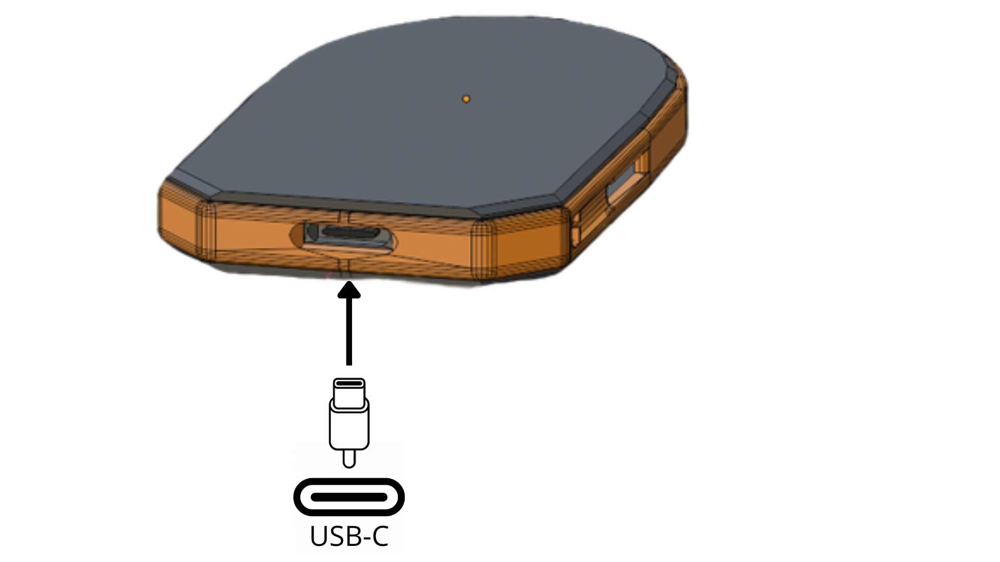 
The device can only be charged by a USB-C charger of any power, we recommend charging it from a wall outlet.

>
<u>**Advice :**</u> For a better battery life, please charge it between 20% and 80%, otherwise this may reduce the battery's effectiveness.
  

#### 2.2.3 Near Field Communication (NFC)
Located at the back of the device, it has a range of 0,5 centimeters and should work with the provided security card.
         

#### 2.2.4 Physical security features
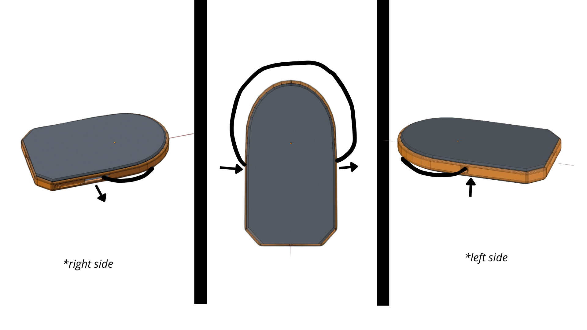 
The locker system works with a multi-layered cable which can be adapted as the length you want to secure any equipements.
There is a outgoing cable at the right of the device which can be locked at the left side of the device with an electromagnet.
                        

- - -

## 3. User Interface Description
### 3.1 Connection: Instructions for connecting the device to user's equipement
| Steps | Instruction | Visual |
| ------- | ----------- | ------ |
|  | You can connect the SportShield device to your phone by bluetooth or NFC | 

 |
| 1st way | Bluetooth : you can select manually your device with the bluetooth option. | 
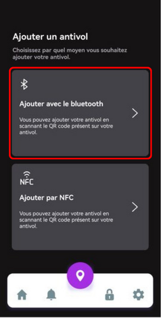
 |
|  |  |  |
| Step 1 | After clicking on the Bluetooth option, you just need to scan for your device which must be near for the first connection. | 
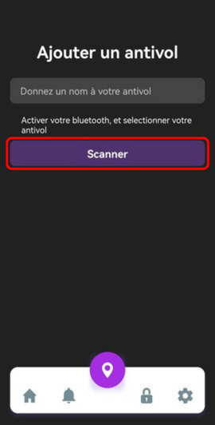
 |
| Step 2 | After scanning it, you need to select your device (your localization must be enabled). | 
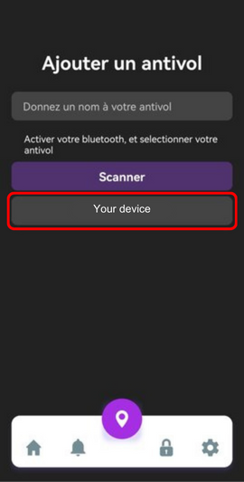
 |
| Step 3 | You may need to click a second time on your device to confirm it. | 
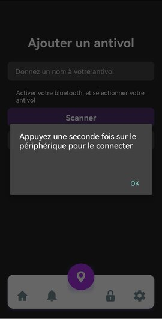
 |
| Step 4 | Connect the app to your device, the device will play a very short melody to confirm your connection. | 
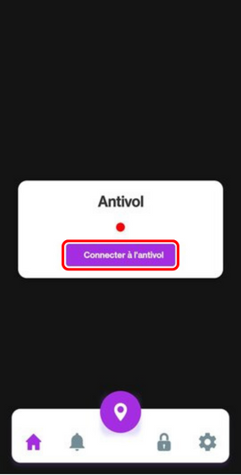
 |
| Step 5 | Result : Now you're connected. | 
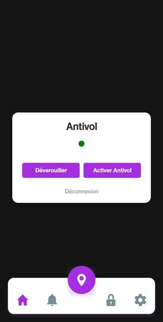
 |
|  |  |
| 2nd way | NFC : if your phone is equipped with NFC technology, you can add your device to the app by scanning it closely under the device. (*more informations below*) | 

 |

       

### 3.2 Security card Setup: Step-by-step for the device for the security card setup and pairing
If your phone need to be paired with the mobile app, you can add a security card to the device by following these steps :
1. in the mobile app, click on the "Add Security card" button.
2. Present the security card to the device when the mobile app displays a message that ask you to until it confirms that the security card has been added.

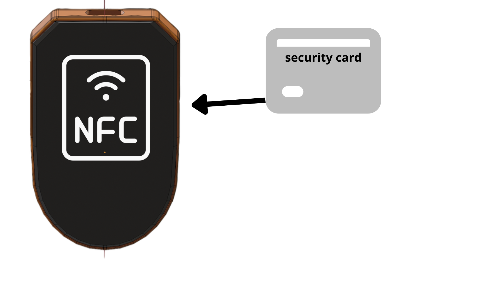

- - -
   

## 4. Safety Warning

 
To avoid any damage or disfunction of the device, follow these safety warnings :
- The device must be used in an environment where the temperature is between -15°C and +45°C
- Take care of the charging port which should not be cluttered.
- This product has no user-serviceable parts. Do not attempt to repair to avoid permanent damage.

>However, the device should be waterproof and robust against break-in attempts.

- - -

## 5. Operation Guide
### 5.1 Enabling or disabling the Anti-Theft Protection and unlock the device
#### 5.1.1 Activate and deactivate the Anti-Theft Protection using the Mobile App
In the Mobile App, go on your device and click on the "Activate Anti-Theft Protection" button. The mobile app displays a message to confirm that the anti-theft protection is activated.
The same button is changed by "Deactivate Anti-Theft Protection" which disable this protection if it is clicked, the Mobile App displays a message to confirm that the anti-theft protection is deactivated.

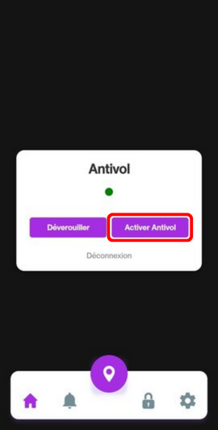

To unlock the device, you need to click on the "Unlock" button, which will displays a message to confirm that the device is unlocked.

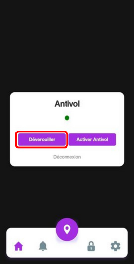
   

#### 5.1.2 Activate and deactivate the Anti-Theft Protection and unlock the device by using the Security Card
Present your security card to the device, it will play a sound to confirm that the anti-theft protection is enabled or disabled.
To unlock it, you need to present your security card to the device a second time which will play a different sound. 
 

### 5.2 Location and battery Tracking: Viewing device location and battery via app
You see the GPS coordinates on the map and the battery level inside the Mobile App. (*the device must have battery*)
It can send a notification on your phone to prevent you when the battery is low or when it is full.

   

### 5.3 Cut the Alarm off
#### 5.3.1 Cut the Alarm with the Mobile App
If the alarm of the device is activated, you can cut it on the Mobile App with the "Cut Alarm" button, it will displays a message to confirm that the alarm is cut.

#### 5.3.2 Cut the Alarm with the Security Card
Present your security card to the device, it will cut the alarm and play a sound to confirm that the alarm is cut.

### 5.4 Sleep Mode Activation: Instructions for conserving battery life
The device will enter in sleep mode to reduce the power consumption, it will enter in this mode when the device is not connected to the mobile app and when the device is not in anti-theft mode, it will emit a sound when it enters sleep mode.

>The device will exit from sleep mode when it is connected to the mobile app or when it is in anti-theft mode.

                           

- - -

## 6. TroubleShooting
| Problem | Solution |
| ----------------- | -------- |
| **The device doesn't connect with your device**            | 1. Check the SportShield is power on and within searchable distance.  2. Check whether there are too many Bluetooth receivers around, turn un-necessary. |
| **The nfc doesn't detect the security card or the phone**  | 1. Pair again the security card (*guide in the 4.2*). |
| **The locker doesn't lock or unlock**                      | 1. Battery might be low, please charge the device. |
| **The localization doesn't work**                          | 1. Battery might be low, please charge the device. |
| **The buzzer doesn't work or too low**                     | 1. Battery might be low, please charge the device.  2. The buzzer might be cluttered, please clean it. |
| **The device doesn't detect any shock**                    | 1. Battery might be low, please charge the device.  2. deactivate and activate back the Anti-Theft Protection. |
| **The Alarm doesn't cut off**                              | 1.1. Restart the Mobile App then retry.  1.2. Wait a minute before presenting your security card to the device.|

>**If any of these solutions doesn't work, please contact the Customer Support** (*contacts in the 9.*)

                     

- - -

## 7. Glossary

| Words | Short definition |
| ----------------- | ----------------- |
| **Anti-Theft Protection** | Security feature that prevents unauthorized access |
| **NFC** | Near Field Communication, technology for contactless data exchange |
| **GPS** | Global Positioning System, satellite-based navigation system |
| **Sleep Mode** | Power-saving mode that reduces device activity |
| **Mobile App** | Application designed to run on mobile devices |
| **Security Card** | Card used for authentication purposes |
| **Locker** | Component used for securing equipment, like a padlock |
| **Bluetooth** | Wireless technology for exchanging data over short distances |
| **Buzzer** | Audible signaling device |
| **USB-C** | Universal Serial Bus Type-C, a connector for transferring data and power |
| **Alarm** | Audible warning signal |
| **Troubleshooting** | Process of identifying and resolving problems |
| **Customer Support** | Service provided to users for assistance with products |

   

- - -

   

## 8. Contact Details
- **Customer Support E-mail :** supportmail@support.com
- **Customer Support Phone Number :** +1 (800) 555-1234

  

- - -